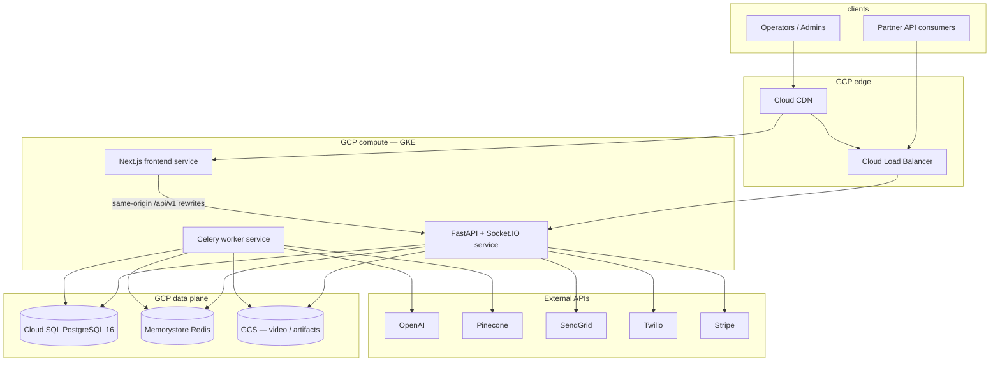
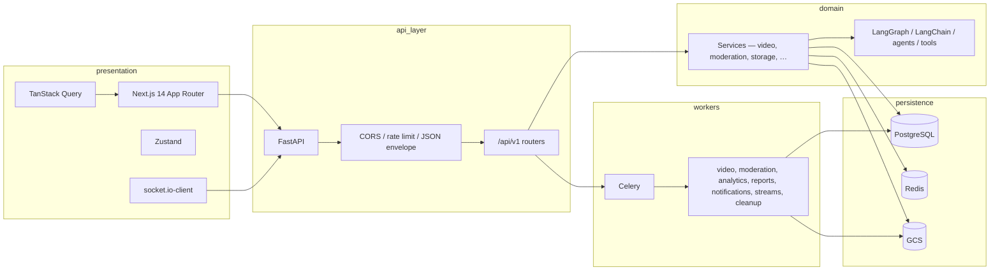
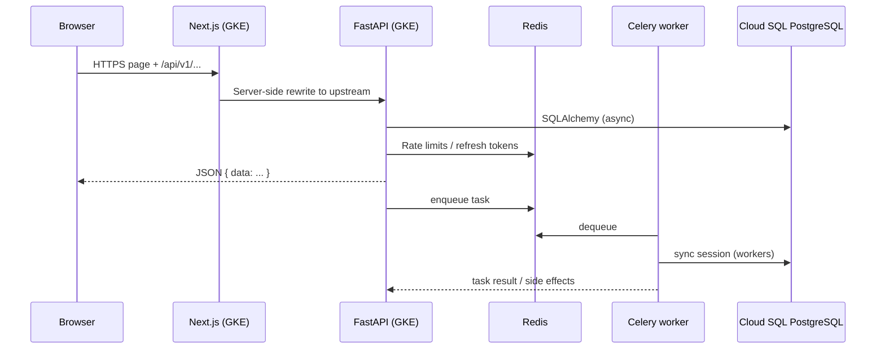

# VidShield AI — Video Intelligence & Content Moderation Platform

[](https://github.com/euronone/Project-6-AI-Video-Intelligence-Content-Moderation-Platform/actions/workflows/ci.yml)
[](LICENSE)
[](https://www.python.org/)
[](https://nextjs.org/)
[](https://fastapi.tiangolo.com/)
[](https://www.postgresql.org/)
[](https://cloud.google.com/)

**VidShield AI** is an enterprise-oriented platform for **recorded video workflows**, **AI-assisted moderation**, **live stream monitoring**, **analytics**, **policies**, **webhooks**, **reports (PDF)**, **billing (Stripe)**, and **operator notifications**. The system is designed to run **on GCP** (GKE, Cloud SQL, Memorystore, GCS, Cloud CDN) while remaining fully developable **locally** via Docker Compose.

---

## Table of contents

1. [Architecture overview](#architecture-overview)  
2. [Tech stack](#tech-stack)  
3. [Repository map](#repository-map)  
4. [GCP cloud deployment](#gcp-cloud-deployment)  
5. [Local development](#local-development)  
6. [Makefile & tooling](#makefile--tooling)  
7. [API & realtime](#api--realtime)  
8. [Documentation](#documentation)  
9. [License](#license)

---

## Architecture overview

### System context (GCP and clients)



Typical production pattern (as reflected in frontend config and `docs/DEPLOYMENT.md`): the **browser** calls **`https://<your-domain>/api/v1/...`** on the same origin; the **Next.js** service forwards those requests to the **internal API** URL (`API_UPSTREAM_URL` / upstream behind the Google Cloud Load Balancer).

### Application layers



### Request and async pipeline



---

## Tech stack

Values below are taken from **`backend/pyproject.toml`**, **`frontend/package.json`**, **`docker-compose.yml`**, and **`terraform/`** modules.

| Layer | Technology |
|--------|------------|
| **Language — backend** | Python **3.12+** |
| **Web framework** | **FastAPI** 0.115, **Uvicorn** 0.30, **Pydantic** v2 |
| **API docs** | OpenAPI — `/docs`, `/redoc` when not in `production` |
| **Database** | **PostgreSQL 16**; **SQLAlchemy** 2.0, **Alembic** |
| **DB drivers** | **asyncpg** (async), **psycopg2** (sync / workers / CLI) |
| **Cache & broker** | **Redis 7**; **Celery** 5.4 (JSON tasks; optional **rediss://** TLS) |
| **Auth** | **JWT** (access + refresh), **passlib[bcrypt]**, **python-jose** |
| **AI / ML** | **OpenAI** SDK; **LangChain** 0.2.x; **LangGraph** 0.2.x; default models **gpt-4o** / **gpt-4o-mini** (configurable) |
| **Vector DB** | **Pinecone** client (`PINECONE_API_KEY`, `PINECONE_INDEX`) |
| **Video / media** | **FFmpeg**, **OpenCV** headless, **yt-dlp** |
| **Object storage** | **Google Cloud Storage (GCS)** via **google-cloud-storage** |
| **Realtime** | **python-socketio** (ASGI) + **FastAPI WebSocket** (live routes) |
| **Email / SMS-style** | **SendGrid**; **Twilio** (WhatsApp) |
| **Payments** | **Stripe** (checkout, portal, webhooks) |
| **PDF reports** | **ReportLab** |
| **Logging** | **structlog** |
| **Language — frontend** | **TypeScript**, **Node 20** (Dockerfile) |
| **UI framework** | **Next.js** **14.2** (App Router), **React** 18 |
| **Styling / components** | **Tailwind CSS** 3, **Radix UI**, **shadcn-style** primitives |
| **Data & forms** | **TanStack Query** 5, **Zustand** 5, **React Hook Form**, **Zod** |
| **Charts / player** | **Recharts**, **react-player** |
| **Testing** | **pytest** (backend), **Jest** + **Playwright** (frontend) |
| **Lint / format** | **ruff** (backend), **ESLint** (frontend) |
| **Containers** | **Docker** multi-stage builds; **Docker Compose** |
| **IaC — GCP** | **Terraform** (GCP provider): VPC, **Cloud SQL**, **Memorystore**, **GKE**, **GCS**, **Cloud CDN**, **Pub/Sub**, monitoring |
| **Orchestration (optional)** | **Kubernetes** manifests under `k8s/` + `Makefile` targets |
| **CI/CD** | **GitHub Actions** — `ci.yml` (lint/test), **`cd-prod.yml`** (Artifact Registry + GKE rollout + optional Cloud CDN invalidation) |

---

## Repository map

```
├── backend/                 # FastAPI app, Alembic, Celery, AI package
│   ├── app/main.py          # FastAPI + Socket.IO ASGI (asgi_app)
│   ├── app/api/v1/          # REST routers
│   ├── app/workers/         # Celery tasks & routing
│   ├── app/ai/              # Graphs, chains, agents, tools
│   ├── alembic/versions/  # DB migrations (head: 0014_*)
│   └── Dockerfile
├── frontend/                # Next.js 14 (standalone output)
│   ├── src/app/             # Routes: dashboard, videos, moderation, live, …
│   ├── src/lib/             # API client, constants, apiOrigin (HTTPS)
│   └── Dockerfile
├── docker-compose.yml       # Local: postgres, redis, backend, worker, frontend
├── docker-compose.prod.yml  # Production-oriented overrides
├── Makefile                 # dev, test, lint, terraform, k8s helpers
├── terraform/               # GCP modules + env tfvars
├── k8s/                     # Optional Kubernetes deployment
└── .github/workflows/       # CI + CD pipelines
```

---

## GCP cloud deployment

Infrastructure-as-code lives in **`terraform/`** (modules for VPC, GKE, Cloud SQL PostgreSQL, Memorystore Redis, GCS, Cloud CDN, Pub/Sub, monitoring). Environment inputs are under **`terraform/environments/`** (`dev`, `staging`, `prod` tfvars).

### CI/CD pipeline (production)

The workflow **`.github/workflows/cd-prod.yml`** (manual dispatch with image tag, or semver tag `v*.*.*`) does the following:

1. **Build and push** container images to **Google Artifact Registry (GAR)**.
2. **Authenticate to GCP** using Workload Identity Federation.
3. **Roll out** backend, worker, and frontend images on **GKE** deployments.
4. **Wait** for rollout stability on targeted GKE workloads.
5. **Invalidate Cloud CDN** when the repository variable **`CLOUD_CDN_URL_MAP`** is configured.

Required **GitHub secrets** (non-exhaustive; see workflow): `GCP_PROJECT_ID`, `GCP_WORKLOAD_IDENTITY_PROVIDER`, `GCP_SERVICE_ACCOUNT`, `GAR_LOCATION`, `GAR_REPOSITORY`, `GKE_CLUSTER_PROD`, `GKE_CLUSTER_LOCATION`, `NEXT_PUBLIC_API_URL`, `API_UPSTREAM_URL`, and Stripe/build secrets used in workflow.

### Terraform operations

```bash
make tf-plan ENV=dev
make tf-apply ENV=dev
```

Remote state for Terraform is configured in **`terraform/main.tf`**; adjust backend settings for your GCP environment before first apply.

### Runtime configuration on GCP

- **Backend / worker:** inject `DATABASE_URL`, `REDIS_URL`, `SECRET_KEY`, `CORS_ORIGINS`, `GCP_PROJECT_ID`, `GCS_BUCKET_NAME`, `GCS_SERVICE_ACCOUNT_KEY_PATH` (local only), `OPENAI_API_KEY`, optional `PINECONE_*`, `SENDGRID_*`, `TWILIO_*`, `STRIPE_*`, `FRONTEND_URL`, etc. (see **`backend/app/config.py`** and **`backend/.env.example`**).
- **Frontend build:** for HTTPS sites, production builds use **same-origin** API paths (`NEXT_PUBLIC_APP_ENV=production` → empty public API base in `frontend/src/lib/constants.ts`) so the browser never mixes `http` API calls on an `https` page. **Next.js rewrites** (`frontend/next.config.js`) proxy `/api/v1/*` to **`API_UPSTREAM_URL`** (internal service URL behind GKE service/load balancer routing).

Full step-by-step reference: **[docs/DEPLOYMENT.md](docs/DEPLOYMENT.md)**.

---

## Local development

### Option A — Docker Compose (recommended)

```bash
cp backend/.env.example backend/.env   # configure keys and URLs
make dev
```

Services (see **`docker-compose.yml`**):

| Service | Purpose | Host ports (default) |
|---------|---------|----------------------|
| **postgres** | PostgreSQL 16 | **5432** |
| **redis** | Redis 7 | **6380** → container 6379 |
| **backend** | API + migrations + seed | **8000** |
| **worker** | Celery (all product queues) | — |
| **frontend** | Next.js | **3000** |

Compose sets `DATABASE_URL` / `REDIS_URL` for the Docker network. Set **`NEXT_PUBLIC_MOCK_API`** to **`"false"`** in compose if you want the UI to call the real backend via Next rewrites instead of mock routes.

### Option B — bare metal

**Backend**

```bash
cd backend
python -m venv .venv
# Windows: .venv\Scripts\activate
pip install -e ".[dev]"
alembic upgrade head
uvicorn app.main:asgi_app --reload --host 0.0.0.0 --port 8000
```

**Frontend**

```bash
cd frontend
npm ci
npm run dev
```

Use **`NEXT_PUBLIC_API_URL=http://localhost:8000`** (development) so the dev server can reach the API, unless you rely on same-origin mocks.

---

## Makefile & tooling

| Target | Description |
|--------|-------------|
| `make dev` | `docker compose up --build` |
| `make test` | Backend pytest + frontend Jest |
| `make lint` | Ruff + ESLint |
| `make db-migrate` | `alembic upgrade head` |
| `make k8s-apply` | Apply manifests under `k8s/` (see Makefile for variables) |

---

## API & realtime

| Surface | Path / notes |
|---------|----------------|
| **REST** | **`/api/v1/...`** — see **[docs/API_SPEC.md](docs/API_SPEC.md)** |
| **Health** | **`GET /health`** |
| **OpenAPI** | **`/docs`**, **`/redoc`** when `APP_ENV` ≠ `production` |
| **Socket.IO** | **`/socket.io/`** (wrapped ASGI app) |
| **WebSocket (live)** | Under **`/api/v1/live/...`** per `live` router |

Successful JSON responses use the **`{ "data": ... }`** envelope (see `DataWrapperMiddleware` in the backend).

---

## Documentation

| Document | Description |
|----------|-------------|
| [docs/PRD.md](docs/PRD.md) | Product scope as implemented |
| [docs/ARCHITECTURE.md](docs/ARCHITECTURE.md) | Deep dive: middleware, workers, security |
| [docs/API_SPEC.md](docs/API_SPEC.md) | Endpoint catalog and error conventions |
| [docs/DB_SCHEMA.md](docs/DB_SCHEMA.md) | Tables, columns, migrations |
| [docs/DEPLOYMENT.md](docs/DEPLOYMENT.md) | Docker, GKE, Terraform, Kubernetes, secrets |

---

## License

This project is intended to be used under the **MIT License**. See the **[LICENSE](LICENSE)** file at the repository root when present.
