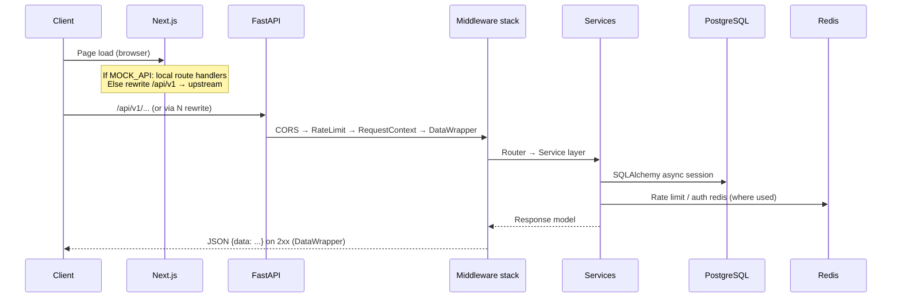
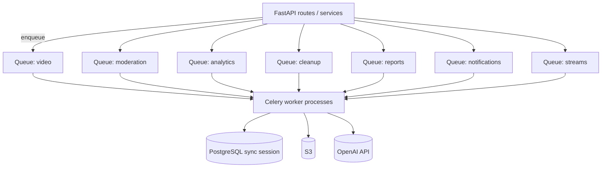

# VidShield AI — System Architecture (As Implemented)

---

## 1. Repository layout

```
Project root
├── backend/                 # FastAPI app, Alembic, Celery workers, AI package
│   ├── app/
│   │   ├── main.py          # FastAPI app + Socket.IO ASGI wrapper (asgi_app)
│   │   ├── config.py        # Pydantic Settings (env)
│   │   ├── dependencies.py  # Async engine, Redis, DB session
│   │   ├── api/v1/        # HTTP routers (versioned)
│   │   ├── models/        # SQLAlchemy ORM
│   │   ├── schemas/       # Pydantic request/response models
│   │   ├── services/      # Domain services (video, moderation, storage, …)
│   │   ├── ai/            # Agents, graphs, chains, tools, prompts
│   │   ├── workers/       # Celery app + task modules
│   │   └── core/          # security, exceptions, middleware, logging, rate_limit
│   ├── alembic/
│   ├── Dockerfile
│   └── pyproject.toml
├── frontend/                # Next.js 14 (App Router)
│   ├── src/app/             # Routes (auth, dashboard, videos, moderation, live, …)
│   ├── src/components/
│   ├── src/lib/             # api client, constants, apiOrigin (HTTPS upgrade)
│   └── Dockerfile
├── docker-compose.yml
├── docker-compose.prod.yml
├── Makefile
├── terraform/               # AWS modules (VPC, RDS, ECS, ElastiCache, S3, CF, …)
├── k8s/                     # Kubernetes manifests + migrate job
└── .github/workflows/       # ci.yml, cd-prod.yml, …
```

---

## 2. Request path (HTTP)



**Middleware order** (comment in `main.py`): outer → inner **CORS → RateLimit → RequestContext → DataWrapper**. Successful JSON is wrapped as `{"data": ...}` except paths in `_SKIP_PATHS` (`/health`, `/docs`, `/redoc`, `/openapi.json`).

**Errors:** `AppException` and handlers return `{"error": {"code", "message", "details"}}`.

---

## 3. Async processing (Celery)



- **Broker/backend:** `CELERY_BROKER_URL` / `CELERY_RESULT_BACKEND` default derived from `REDIS_URL` in `Settings`.
- **TLS:** `celery_app.py` sets SSL options when broker URL starts with `rediss://`.
- **Beat:** `daily-digest-0800-utc` schedule in `celery_app.conf.beat_schedule`.

---

## 4. AI moderation pipeline (code organization)

| Area | Path | Role |
|------|------|------|
| Graphs | `app/ai/graphs/` | LangGraph workflows (`video_analysis_graph`, `moderation_workflow`) |
| Chains | `app/ai/chains/` | LCEL-style chains for moderation, insights, summaries |
| Agents | `app/ai/agents/` | Orchestrator, analyzers, safety, metadata, scene, report, live moderator |
| Tools | `app/ai/tools/` | Frames, Whisper transcription, OCR, object detection, similarity (Pinecone), face analyzer |
| Prompts | `app/ai/prompts/` | Prompt templates |
| Audit hook | `app/ai/pipeline_agent_audit.py` | Agent audit persistence integration |

Workers (`video_tasks`, `moderation_tasks`, etc.) invoke services and graphs — see task modules for exact call graph.

---

## 5. Realtime

- **Socket.IO:** `socketio.AsyncServer` mounted at `/socket.io` via `socketio.ASGIApp` wrapping FastAPI. Events `connect`, `disconnect`, `join`, `leave` are defined in `main.py` (room join/leave only).
- **Native WebSocket:** `live.py` exposes `/api/v1/live/ws/streams/{stream_id}` for stream-scoped updates (implementation detail in router).

Frontend uses `socket.io-client` and `WS_URL` / same-origin resolution from `frontend/src/lib/constants.ts`.

---

## 6. Authentication & authorization

- **JWT Bearer** (`Authorization: Bearer <access_token>`) parsed in `app/api/deps.py` (`HTTPBearer`).
- **Role gates:** `require_role` → `AdminUser`, `OperatorUser` typed dependencies.
- **API keys:** persisted and manageable via `/api/v1/api-keys` but **not** used as middleware auth in `deps.py` (Bearer-only for protected routes).

---

## 7. External integrations

| Integration | Config | Usage |
|-------------|--------|--------|
| AWS S3 | `AWS_*`, `S3_BUCKET_NAME` | Video + artifact storage, presigned URLs |
| OpenAI | `OPENAI_API_KEY`, models | Vision/text/Whisper paths |
| Pinecone | `PINECONE_API_KEY`, `PINECONE_INDEX` | `similarity_search` tool |
| SendGrid | `SENDGRID_API_KEY`, from fields | `email_service` |
| Twilio | `TWILIO_*` | WhatsApp notifications |
| Stripe | `STRIPE_*` | Billing + webhook |
| Sentry | `SENTRY_DSN` | Setting exists in `config.py`; **no Sentry SDK initialization** appears in `app/` (only the env placeholder) |

---

## 8. Infrastructure (as code)

- **Terraform:** modular AWS stack (`terraform/modules/*`) orchestrated in `terraform/main.tf`.
- **GitHub Actions CD:** ECR image build + ECS service deploy (`cd-prod.yml`).
- **Kubernetes:** `k8s/*.yaml` for alternative deployment; Makefile targets for apply/migrate/logs.

---

## 9. Frontend architecture

- **Next.js App Router** with route groups `(auth)` and `(app)`.
- **Data fetching:** TanStack Query + centralized API helpers (`src/lib/api.ts`, `apiOrigin.ts`).
- **Same-origin production API:** `NEXT_PUBLIC_APP_ENV` production/staging forces empty public API base so browsers call `/api/v1` on the site origin; Next **rewrites** forward to `API_UPSTREAM_URL`.

---

## 10. Security controls (implemented patterns)

- Password hashing via passlib/bcrypt configuration in security module.
- Rate limiting middleware with Redis-backed fixed windows (`app/core/rate_limit.py`); fail-open if Redis unavailable.
- CORS allowlist via `CORS_ORIGINS` setting.
- Stripe webhook uses raw body + signature verification.

---

## 11. Observability

- Structured logging via `structlog` with Celery task signals in `celery_app.py`.
- Request context middleware binds user metadata when authenticated.
