# VidShield AI — Full AWS Architecture Design Document

This document synthesizes **`docs/PRD.md`**, **`docs/ARCHITECTURE.md`**, **`docs/DEPLOYMENT.md`**, **`docs/DB_SCHEMA.md`**, **`docs/API_SPEC.md`**, **`docs/HDL.md`**, and **`docs/LDL.md`** with the **Terraform modules** under `terraform/` to describe a **complete AWS-hosted architecture** for VidShield AI.

**Purpose:** Single reference for stakeholders and for importing diagrams into **[eraser.io](https://eraser.io)** (or any Mermaid-capable tool). Each diagram is in its own **fenced `mermaid` code block** — copy the block contents (including the opening ` ```mermaid ` and closing ` ``` `) into Eraser’s Mermaid import, or paste only the inner diagram source per Eraser’s UI.

**Scope note:** Third-party SaaS used by the application (**OpenAI**, **Pinecone**, **Stripe**, **SendGrid**, **Twilio**) are shown as external systems; everything else below is **AWS** or **internet clients**.

---

## Table of contents

1. [Architecture principles](#1-architecture-principles)  
2. [AWS service inventory](#2-aws-service-inventory)  
3. [Logical component map](#3-logical-component-map)  
4. [Mermaid diagrams (copy for eraser.io)](#4-mermaid-diagrams-copy-for-eraserio)  
   - [4.1 System context — users, AWS edge, compute, data](#41-diagram-1--system-context)  
   - [4.2 VPC network topology](#42-diagram-2--vpc-network-topology)  
   - [4.3 ECS Fargate services and load balancing](#43-diagram-3--ecs-fargate-services-and-load-balancing)  
   - [4.4 S3 storage and CloudFront origins](#44-diagram-4--s3-storage-and-cloudfront-origins)  
   - [4.5 Security — WAF, secrets, IAM, encryption](#45-diagram-5--security-waf-secrets-iam-encryption)  
   - [4.6 Video ingestion and presigned upload flow](#46-diagram-6--video-ingestion-sequence)  
   - [4.7 AI moderation pipeline — API, Redis, workers](#47-diagram-7--ai-moderation-pipeline-sequence)  
   - [4.8 Realtime — ALB stickiness / WebSocket and Socket.IO](#48-diagram-8--realtime-connectivity)  
   - [4.9 CI/CD — GitHub Actions, ECR, ECS](#49-diagram-9--cicd-pipeline)  
   - [4.10 Observability — CloudWatch and SNS](#410-diagram-10--observability)  
   - [4.11 High availability and failure domains](#411-diagram-11--high-availability)  
   - [4.12 Optional — SQS decoupling (Terraform module)](#412-diagram-12--optional-sqs-integration)  
5. [Data classification and boundaries](#5-data-classification-and-boundaries)  
6. [Cross-reference to repo docs](#6-cross-reference-to-repo-docs)

---

## 1. Architecture principles

| Principle | AWS expression |
|-----------|------------------|
| **Separation of tiers** | Public subnets (ALB, NAT) vs private subnets (ECS tasks, RDS, Redis) |
| **Least privilege** | IAM task roles per service; resource-based S3 policies; Secrets Manager ARNs in task definitions |
| **Encryption in transit** | TLS 1.2+ via **ACM** on **ALB** / **CloudFront**; `rediss://` to ElastiCache where TLS enabled |
| **Encryption at rest** | **RDS** storage encryption; **S3** SSE-S3 or SSE-KMS; **ElastiCache** at-rest encryption (configure in module) |
| **Defense in depth** | **WAFv2** on CloudFront + ALB (as in `terraform/main.tf`) |
| **Observable operations** | **CloudWatch** Logs/Metrics, alarms → **SNS** (monitoring module + optional email subscription) |
| **Immutable deploys** | New **ECR** image tags → new **ECS** task definitions → rolling **ECS** deployments |

---

## 2. AWS service inventory

| AWS service | Role in VidShield AI |
|-------------|----------------------|
| **Amazon VPC** | Isolated network; public/private subnets; route tables; **Internet Gateway**; **NAT Gateway(s)** |
| **Application Load Balancer (ALB)** | HTTP(S) entry for API and/or combined routing; WebSocket upgrade; target groups for ECS services |
| **Amazon ECS on AWS Fargate** | Run **API** (FastAPI + Socket.IO), **Celery worker**, **Next.js frontend** without managing EC2 |
| **Amazon ECR** | Store Docker images for API/worker/frontend; scanned on push (optional **ECR** image scanning) |
| **Amazon RDS for PostgreSQL** | Primary relational store (users, videos, moderation, billing, audits, …) per `DB_SCHEMA.md` |
| **Amazon ElastiCache for Redis** | Rate limiting, Celery broker/result backend, refresh-token / ephemeral patterns |
| **Amazon S3** | Video objects, thumbnails, generated report PDFs / artifacts (Terraform: separate buckets for videos, thumbnails, artifacts) |
| **Amazon CloudFront** | CDN for static assets / optional API caching; custom domain; origin to ALB; OAC/OAI for S3 origins where used |
| **AWS WAF** | Web ACL **CLOUDFRONT** scope + **REGIONAL** scope attached to ALB |
| **AWS Certificate Manager (ACM)** | TLS certificates for ALB and CloudFront (`certificate_arn` in Terraform) |
| **Amazon Route 53** | DNS A/AAAA alias to CloudFront and/or ALB |
| **AWS Secrets Manager** | DB password, Redis auth, `SECRET_KEY`, OpenAI/Pinecone/Sentry ARNs injected into ECS tasks |
| **AWS KMS** | Customer-managed keys for S3, RDS, Secrets Manager (recommended); envelope encryption |
| **AWS IAM** | Execution roles (pull from ECR, write logs); task roles (S3, SQS, Secrets) |
| **Amazon CloudWatch Logs** | Container logs per ECS service |
| **Amazon CloudWatch Metrics / Alarms** | ECS/RDS/Redis/ALB metrics; 5xx thresholds (monitoring module) |
| **Amazon SNS** | Alarm notifications; optional fan-out to email/Lambda |
| **Amazon SQS** | Optional durable queues for high-volume async work (Terraform `module "sqs"`; extend workers to consume) |
| **AWS Systems Manager Parameter Store** | Optional alternative to Secrets Manager for non-secret config |
| **AWS X-Ray** | Optional distributed tracing (instrument app / sidecar) |
| **Amazon GuardDuty / Security Hub** | Org-level threat and compliance (operations) |
| **AWS Backup** | RDS/S3 backup policies (operations) |
| **Amazon EventBridge** | Scheduled rules (e.g. complement Celery Beat externally) or react to S3 events |
| **AWS Lambda** | Optional: S3 trigger for virus scan, image optimization, or SQS consumer |
| **Amazon SES** | Optional alternative or supplement to SendGrid for outbound email |

**External (non-AWS) integrations (from PRD / code):** OpenAI, Pinecone, Stripe, SendGrid, Twilio.

---

## 3. Logical component map

| Product capability (PRD) | Primary AWS hosts | Supporting AWS |
|----------------------------|-------------------|------------------|
| Web UI + same-origin API | ECS Fargate (frontend + API targets), ALB, CloudFront | WAF, ACM, Route 53 |
| REST `/api/v1` + Socket.IO | ECS Fargate (API service) | ALB stickiness / WebSocket aware idle timeout |
| Celery workers | ECS Fargate (worker service) | ElastiCache Redis; optional SQS |
| PostgreSQL | RDS PostgreSQL Multi-AZ (optional) | KMS, Secrets Manager, automated backups |
| Object storage | S3 (videos, thumbnails, artifacts) | IAM task role; presigned URLs from API |
| Rate limits / cache | ElastiCache Redis | VPC security groups |
| Observability | CloudWatch Logs/Metrics, SNS | Alarm dashboards |
| IaC / drift control | Terraform state in S3 + DynamoDB lock | IAM for CI deploy role |

---

## 4. Mermaid diagrams (copy for eraser.io)

> **How to use in Eraser.io:** Create a new diagram → choose **Mermaid** (or import) → paste one full code block below. If Eraser expects **only** the diagram body, omit the outer markdown fences and paste from `flowchart` / `sequenceDiagram` onward.

---

### 4.1 Diagram 1 — System context

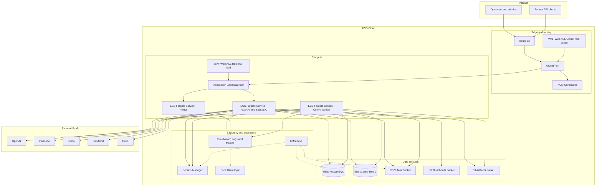

---

### 4.2 Diagram 2 — VPC network topology

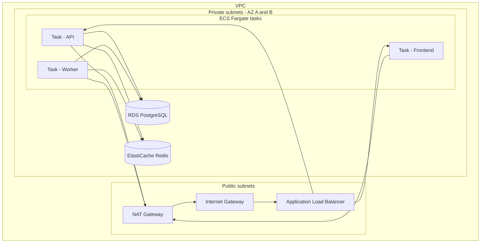

---

### 4.3 Diagram 3 — ECS Fargate services and load balancing

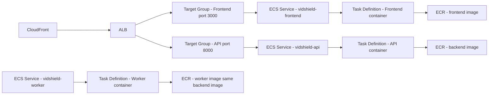

---

### 4.4 Diagram 4 — S3 storage and CloudFront origins

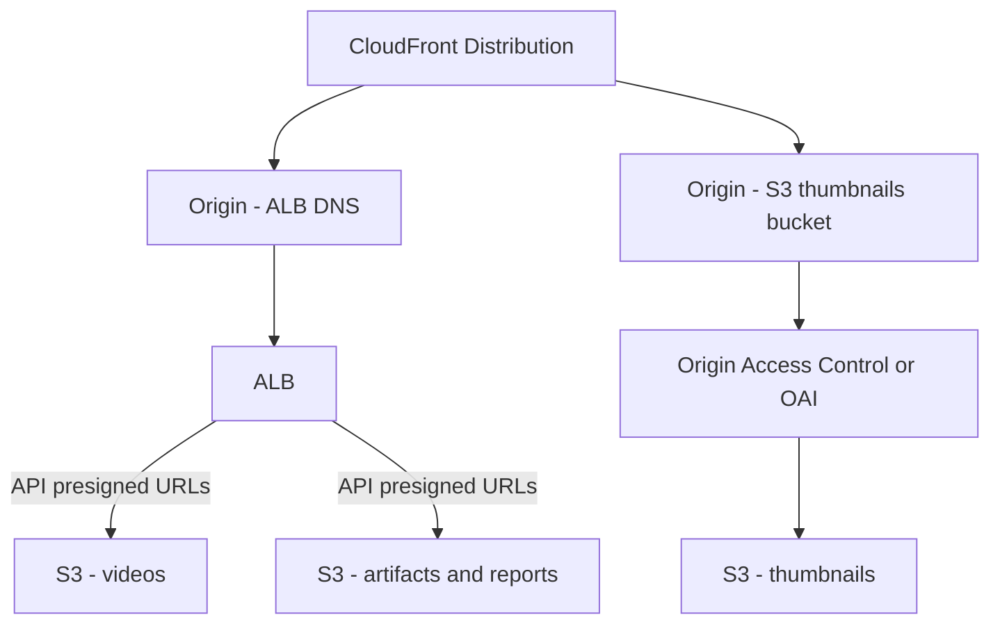

---

### 4.5 Diagram 5 — Security (WAF, secrets, IAM, encryption)

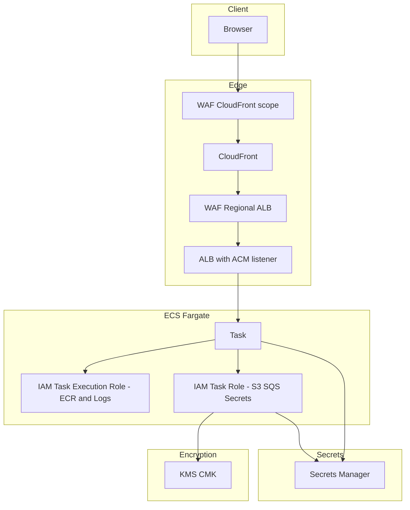

---

### 4.6 Diagram 6 — Video ingestion (sequence)

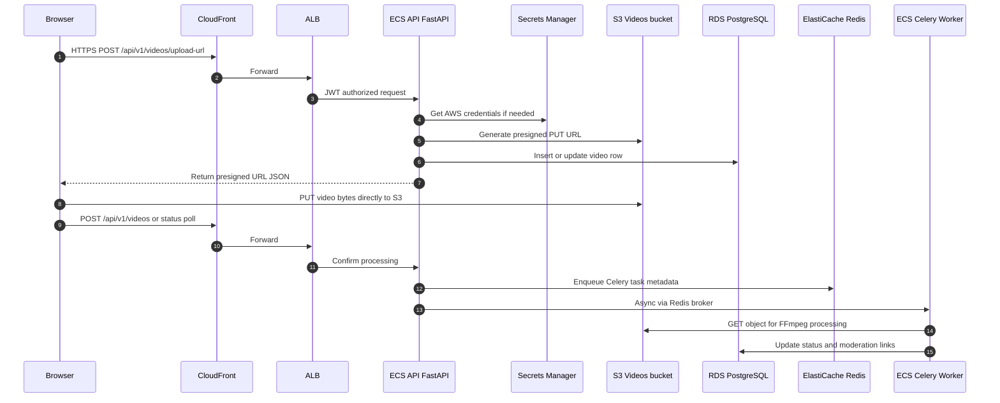

---

### 4.7 Diagram 7 — AI moderation pipeline (sequence)

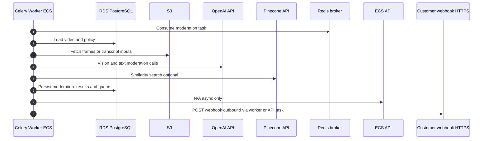

---

### 4.8 Diagram 8 — Realtime connectivity

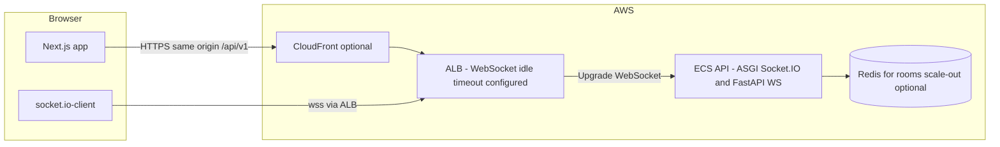

**Design note:** Sticky sessions on ALB target group help Socket.IO long-polling; WebSocket idle timeout on ALB should exceed expected quiet periods for live streams.

---

### 4.9 Diagram 9 — CI/CD pipeline

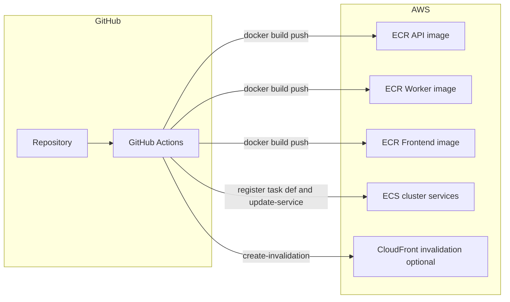

---

### 4.10 Diagram 10 — Observability

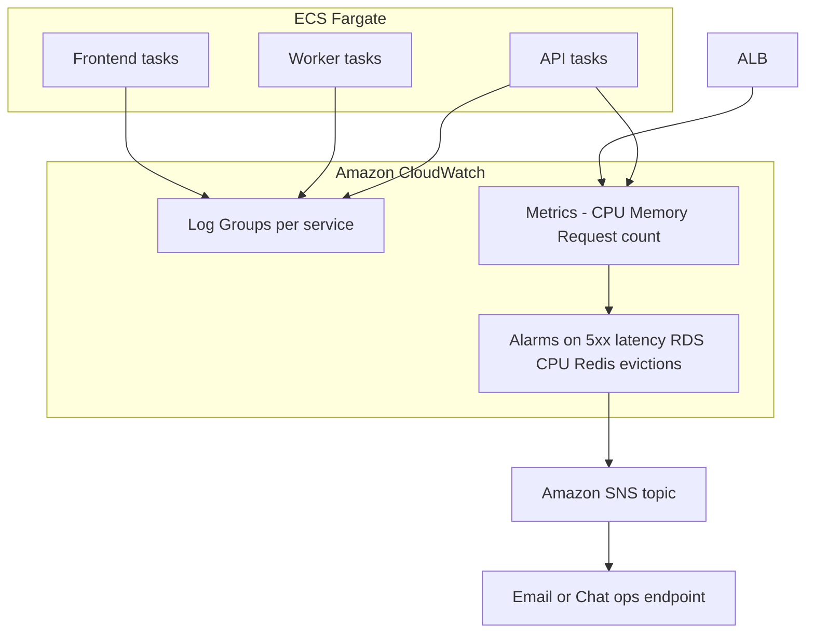

---

### 4.11 Diagram 11 — High availability

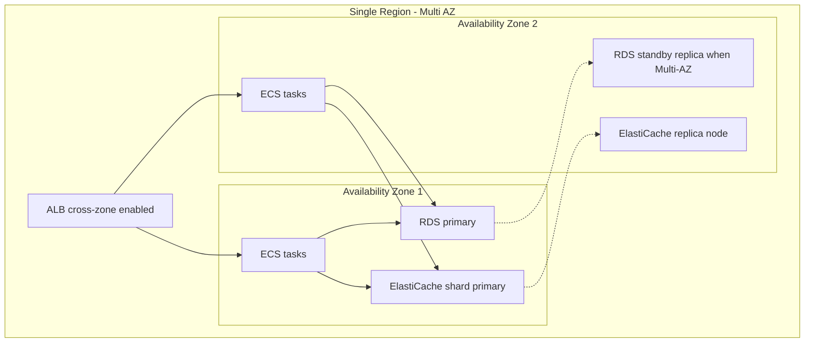

---

### 4.12 Diagram 12 — Optional SQS integration (Terraform)

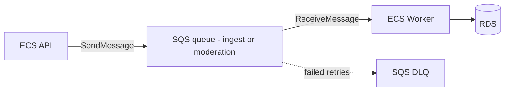

The repository includes **`module "sqs"`** in `terraform/main.tf`; Celery today uses **Redis** as broker. SQS can be used for **cross-service buffering**, **fan-out**, or future **Lambda** consumers while keeping Redis for Celery if desired.

---

## 5. Data classification and boundaries

| Data class | Examples | AWS storage / transit |
|------------|----------|-------------------------|
| **Credentials / keys** | DB password, `SECRET_KEY`, API keys | **Secrets Manager** + **KMS**; never in images |
| **PII** | User email, profile, audit logs | **RDS** encrypted; restrict IAM; retention policies |
| **Video content** | Uploads, thumbnails | **S3** buckets with lifecycle and access logging |
| **AI artifacts** | Embeddings metadata, reports | **S3 artifacts**; Pinecone vectors outside AWS |
| **Sessions / rate limits** | JWT refresh keys, rate limit counters | **Elastiache Redis** with TLS in production |

---

## 6. Cross-reference to repo docs

| Topic | Document |
|-------|----------|
| Product features | [PRD.md](PRD.md) |
| Code-level structure | [ARCHITECTURE.md](ARCHITECTURE.md), [LDL.md](LDL.md) |
| Conceptual design | [HDL.md](HDL.md) |
| HTTP API | [API_SPEC.md](API_SPEC.md) |
| Tables and migrations | [DB_SCHEMA.md](DB_SCHEMA.md) |
| Commands, compose, CI/CD names | [DEPLOYMENT.md](DEPLOYMENT.md) |
| PNG architecture pack | `docs/architecture_images/*.png` |

---

**End of document.** For Eraser.io, import diagrams **one section at a time** to tune layout (Eraser auto-layout may differ from GitHub rendering).
