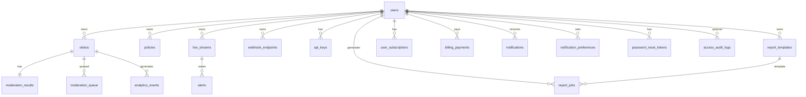

# VidShield AI — Database Schema (As Migrated)

PostgreSQL **16**. ORM: SQLAlchemy 2.0. Migrations: Alembic under `backend/alembic/versions/`.

**Convention:** Enum-like columns are stored as **VARCHAR** (`native_enum=False` in initial migration) unless noted; application enums validate values.

**Head revision:** `0014_add_stripe_customer_id`

**Object storage column names:** Columns named `s3_key`, `thumbnail_s3_key`, and report job `s3_key` are **historical names** from an earlier stack. In the current implementation they store **Google Cloud Storage object keys** (not Amazon S3). Application code and tools use `gs://` URLs where applicable. No schema rename is required for GCP operation.

---

## 1. Entity relationship (high level)



---

## 2. Tables (columns & indexes)

### 2.1 `users` (`0001`, `0002`, `0004`)

| Column | Type | Notes |
|--------|------|-------|
| `id` | UUID PK | |
| `email` | VARCHAR(255) UNIQUE, indexed | |
| `password_hash` | VARCHAR(255) | |
| `name` | VARCHAR(255) NULL, indexed | added `0002` |
| `role` | VARCHAR(64) DEFAULT `operator`, indexed | app: `admin` / `operator` / `api_consumer` |
| `tenant_id` | VARCHAR(255) NULL, indexed | |
| `is_active` | BOOLEAN DEFAULT true | |
| `whatsapp_number` | VARCHAR(32) NULL | `0004` |
| `is_blocked` | BOOLEAN DEFAULT false, indexed | `0004` |
| `blocked_at` | TIMESTAMPTZ NULL | `0004` |
| `blocked_reason` | VARCHAR(500) NULL | `0004` |
| `address_line1` … `country` | various VARCHAR NULL | `0004` |
| `created_at`, `updated_at` | TIMESTAMPTZ | server default `now()` |

Indexes: `ix_users_email` (unique), `ix_users_tenant_id`, `ix_users_role`, `ix_users_name`, `ix_users_is_blocked`.

---

### 2.2 `policies` (`0001`)

| Column | Type | Notes |
|--------|------|-------|
| `id` | UUID PK | |
| `name` | VARCHAR(255) | |
| `description` | TEXT NULL | |
| `is_active`, `is_default` | BOOLEAN | defaults true / false |
| `rules` | JSON NULL | |
| `default_action` | VARCHAR(64) DEFAULT `allow` | |
| `owner_id` | UUID FK → `users.id` ON DELETE CASCADE | indexed |
| `tenant_id` | VARCHAR(255) NULL, indexed | |
| `created_at`, `updated_at` | TIMESTAMPTZ | |

---

### 2.3 `videos` (`0001`, `0003`)

| Column | Type | Notes |
|--------|------|-------|
| `id` | UUID PK | |
| `title` | VARCHAR(500) | |
| `description` | TEXT NULL | |
| `status` | VARCHAR(32) DEFAULT `pending`, indexed | |
| `source` | VARCHAR(32) DEFAULT `upload` | |
| `s3_key`, `thumbnail_s3_key` | VARCHAR(1024) NULL | |
| `source_url` | TEXT NULL | `0003` — external / YouTube-style URL |
| `duration_seconds` | FLOAT NULL | |
| `file_size_bytes` | INTEGER NULL | |
| `content_type` | VARCHAR(128) NULL | |
| `tags` | TEXT NULL | app stores JSON string |
| `owner_id` | UUID FK → `users.id` CASCADE | indexed |
| `tenant_id` | VARCHAR(255) NULL, indexed | |
| `error_message` | TEXT NULL | |
| `deleted_at` | VARCHAR(64) NULL | soft-delete marker |
| `created_at`, `updated_at` | TIMESTAMPTZ | |

Indexes: `ix_videos_owner_id`, `ix_videos_tenant_id`, `ix_videos_status`.

---

### 2.4 `live_streams` (`0001`, `0013`)

| Column | Type | Notes |
|--------|------|-------|
| `id` | UUID PK | |
| `title` | VARCHAR(500) | |
| `ingest_url` | VARCHAR(1024) NULL | |
| `status` | VARCHAR(32) DEFAULT `pending`, indexed | |
| `owner_id` | UUID FK users CASCADE | indexed |
| `tenant_id` | VARCHAR(255) NULL, indexed | |
| `stopped_at` | VARCHAR(64) NULL | |
| `moderation_active` | BOOLEAN DEFAULT false | `0013` |
| `moderation_started_at`, `moderation_stopped_at` | TIMESTAMPTZ NULL | `0013` |
| `frames_processed` | INTEGER DEFAULT 0 | `0013` |
| `created_at`, `updated_at` | TIMESTAMPTZ | |

---

### 2.5 `moderation_results` (`0001`)

One row per video (`video_id` UNIQUE).

Key columns: `status`, `overall_confidence`, `violations` JSON, `summary` TEXT, `ai_model`, `processing_time_ms`, review fields (`reviewed_by`, `review_action`, `review_notes`, `reviewed_at`), override fields (`override_by`, `override_decision`, `override_at`), timestamps.

FK: `video_id` → `videos` CASCADE; `reviewed_by`, `override_by` → `users` SET NULL.

Indexes: `video_id`, `status`.

---

### 2.6 `moderation_queue` (`0001`)

| Column | Type | Notes |
|--------|------|-------|
| `id` | UUID PK | |
| `video_id` | UUID FK videos CASCADE | indexed |
| `moderation_result_id` | UUID FK moderation_results SET NULL | |
| `status` | VARCHAR(32) DEFAULT `pending`, indexed | |
| `priority` | INTEGER DEFAULT 0 | |
| `assigned_to` | UUID FK users SET NULL | |
| `tenant_id` | VARCHAR(255) NULL, indexed | |
| `created_at`, `updated_at` | TIMESTAMPTZ | |

---

### 2.7 `alerts` (`0001`, `0013`)

| Column | Type | Notes |
|--------|------|-------|
| `id` | UUID PK | |
| `stream_id` | UUID FK live_streams CASCADE | indexed |
| `severity` | VARCHAR(32) DEFAULT `medium` | |
| `category` | VARCHAR(128) NULL | |
| `message` | TEXT | |
| `frame_url` | VARCHAR(1024) NULL | |
| `confidence` | FLOAT NULL | `0013` |
| `is_dismissed` | BOOLEAN DEFAULT false | |
| `tenant_id` | VARCHAR(255) NULL, indexed | |
| `created_at`, `updated_at` | TIMESTAMPTZ | |

---

### 2.8 `analytics_events` (`0001`)

| Column | Type | Notes |
|--------|------|-------|
| `id` | UUID PK | |
| `event_type` | VARCHAR(64), indexed | |
| `video_id` | UUID FK videos SET NULL, indexed | |
| `tenant_id` | VARCHAR(255) NULL, indexed | |
| `category` | VARCHAR(128) NULL, indexed | |
| `confidence` | FLOAT NULL | |
| `extra` | VARCHAR(1024) NULL | |
| `event_date` | VARCHAR(10) NOT NULL, indexed | `YYYY-MM-DD` style |
| `created_at`, `updated_at` | TIMESTAMPTZ | |

---

### 2.9 `webhook_endpoints` (`0001`)

Stores outbound webhook config: `url`, `secret`, `events` JSON, counters, `owner_id` FK users CASCADE, `tenant_id`, timestamps.

---

### 2.10 `access_audit_logs` (`0005`)

Login/logout audit: `user_id` FK users SET NULL, `email`, `username`, `action`, `status`, `failure_reason`, `ip_address`, `user_agent`, timestamps.

Indexes on `user_id`, `email`, `action`, `status`, `created_at`.

---

### 2.11 `api_keys` (`0006`)

| Column | Type | Notes |
|--------|------|-------|
| `id` | UUID PK | |
| `user_id` | UUID FK users CASCADE | indexed |
| `name` | VARCHAR(64) | |
| `key_hash` | VARCHAR(64) UNIQUE | SHA-256 hex |
| `masked` | VARCHAR(80) | display only |
| `last_used_at` | TIMESTAMPTZ NULL | |
| `request_count` | INTEGER DEFAULT 0 | |
| `is_revoked` | BOOLEAN DEFAULT false | |
| `created_at`, `updated_at` | TIMESTAMPTZ | |

---

### 2.12 `agent_audit_logs` (`0007`)

AI agent activity: `agent_id`, `action_type`, `description`, `input_ref`, `output_summary`, `status`, `execution_time_ms`, `triggered_by`, `trace_id`, `correlation_id`, `event_timestamp`, timestamps. Multiple indexes for query filters.

---

### 2.13 `report_templates` / `report_jobs` (`0008`)

- **report_templates:** `name`, `description`, `report_type`, `filters` TEXT, `columns` TEXT, `orientation`, `owner_id` FK CASCADE, `is_shared`, `tenant_id`, timestamps.
- **report_jobs:** `title`, `report_type`, `status`, `filters`, `columns`, `orientation`, `s3_key`, `file_size_bytes`, `row_count`, `error_message`, `celery_task_id`, `template_id` FK SET NULL, `generated_by` FK CASCADE, `tenant_id`, timestamps.

---

### 2.14 `newsletter_signups` (`0009`)

`email` UNIQUE indexed; timestamps.

---

### 2.15 `user_subscriptions` (`0009`, `0014`)

| Column | Type | Notes |
|--------|------|-------|
| `id` | UUID PK | |
| `user_id` | UUID FK users CASCADE UNIQUE | |
| `plan_key` | VARCHAR(32) DEFAULT `free` | migration renames legacy `pro`→`starter`, `enterprise`→`growth` |
| `status` | VARCHAR(32) DEFAULT `active` | |
| `current_period_end` | TIMESTAMPTZ NULL | |
| `external_subscription_id` | VARCHAR(255) NULL | Stripe subscription id |
| `stripe_customer_id` | VARCHAR(255) NULL, indexed | `0014` |
| `created_at`, `updated_at` | TIMESTAMPTZ | |

---

### 2.16 `billing_payments` (`0009`)

`user_id`, `amount_cents`, `currency` DEFAULT USD, `status`, `paid_at`, `description`, `invoice_number` UNIQUE, `external_payment_id`, timestamps.

---

### 2.17 `support_tickets` (`0010`)

`name`, `email`, `phone`, `subject`, `message`, `status`, `priority`, `admin_notes`, timestamps; indexes on `email`, `status`.

---

### 2.18 `notifications` / `notification_preferences` (`0011`)

- **notifications:** `user_id` FK CASCADE, `channel`, `event_type`, `priority`, `title`, `message`, `data` JSON, `status`, `scheduled_at`, `sent_at`, `read_at`, `delivery_meta` JSON, `retry_count`, `tenant_id`, timestamps; indexes on user, channel, event_type, status, tenant.
- **notification_preferences:** per (`user_id`,`channel`,`event_type`) unique; quiet hours integers; `frequency`; `enabled`; `tenant_id`.

---

### 2.19 `password_reset_tokens` (`0012`)

`user_id` FK CASCADE, `token_hash` UNIQUE, `expires_at`, `used_at`, `ip_address`, timestamps.

---

## 3. SQLAlchemy models

Python definitions live in `backend/app/models/*.py` and should match the above; `User.role` uses SQLAlchemy `Enum` with `native_enum=False` (PostgreSQL stores string values).

---

## 4. Alembic operations

```bash
cd backend
alembic current
alembic history
alembic upgrade head
```

Create new revision (autogenerate):

```bash
make db-revision MSG="describe_change"
```
