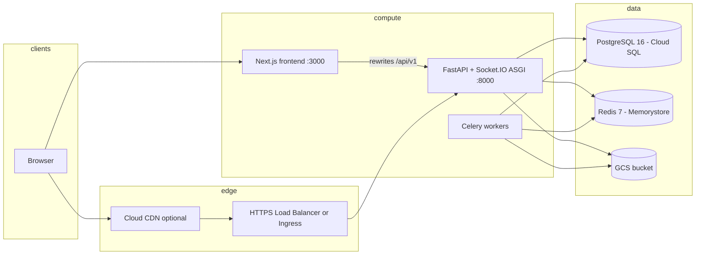

# VidShield AI — Deployment Guide (As Implemented)

This guide reflects **files that exist in the repository**: Dockerfiles, `docker-compose*.yml`, `Makefile`, GitHub Actions workflows, `terraform/`, and (when present) Kubernetes manifests. **Production CI/CD** targets **Google Artifact Registry** and **Google Kubernetes Engine (GKE)** per `.github/workflows/cd-prod.yml` and `cd-staging.yml`.

For a full manual build-out of GCP resources, see **[GCP_DEPLOYMENT_RUNBOOK.md](GCP_DEPLOYMENT_RUNBOOK.md)**.

---

## 1. Runtime topology



---

## 2. Local development (Docker Compose)

**File:** `docker-compose.yml`

Services:

| Service | Image / build | Ports | Notes |
|---------|---------------|-------|-------|
| `postgres` | `postgres:16-alpine` | Host `5432` | DB `vidshield`, user/password `postgres`/`postgres` |
| `redis` | `redis:7-alpine` | Host `6380` → container `6379` |
| `backend` | `./backend` Dockerfile | `8000` | Runs `alembic upgrade head`, `scripts/seed_admin.py`, then `uvicorn app.main:asgi_app --reload` |
| `worker` | same as backend | — | `celery ... --queues video,moderation,analytics,cleanup,reports,notifications,streams` |
| `frontend` | `./frontend` Dockerfile | `3000` | Build args set `NEXT_PUBLIC_API_URL` / `NEXT_PUBLIC_WS_URL`; default `NEXT_PUBLIC_MOCK_API: "true"` in compose |

**Commands:**

```bash
make dev          # docker compose up --build
make dev-d        # detached
make down         # docker compose down
make clean        # down -v --remove-orphans
```

**Backend env:** `backend/.env` (see `backend/.env.example`). Compose overrides `DATABASE_URL`, `REDIS_URL`, Celery URLs, and `CORS_ORIGINS` for the container network.

**Important:** `Makefile` target `dev-backend` runs `uvicorn app.main:app` — the **canonical ASGI app with Socket.IO** is `app.main:asgi_app` (used in `backend/Dockerfile` CMD and docker-compose `backend` service).

---

## 3. Production-style Compose overlay

**File:** `docker-compose.prod.yml`

- Removes public DB/Redis ports.
- Injects secrets and URLs from host environment (`DATABASE_URL`, `REDIS_URL`, `SECRET_KEY`, **GCP / GCS** settings from `config.py`, OpenAI, Pinecone, Sentry, `CORS_ORIGINS`, Stripe-related vars as applicable).
- **Backend command in file:** `uvicorn app.main:app --workers 4` (differs from Dockerfile default `asgi_app` — operators should align on one entrypoint for Socket.IO needs).
- **Worker command:** must pass **`--queues video,moderation,analytics,cleanup,reports,notifications,streams`**. The app routes tasks to named queues (see `backend/app/workers/celery_app.py` `task_routes`); a worker that only listens on the default `celery` queue will **never** run notification, video, or moderation tasks.
- **Frontend build args:** `NEXT_PUBLIC_API_URL`, `NEXT_PUBLIC_WS_URL`, `API_UPSTREAM_URL`, `NEXT_PUBLIC_MOCK_API=false`.

**Makefile:**

```bash
make deploy ENV=staging   # prints message; builds/pushes compose prod stack per Makefile
```

---

## 4. Container images

### Backend (`backend/Dockerfile`)

- Multi-stage: installs `[dev]` extras in build stage, copies site-packages to runtime.
- Runtime installs `ffmpeg`, `libpq5`.
- Exposes `8000`.
- **CMD:** `uvicorn app.main:asgi_app --host 0.0.0.0 --port 8000`

### Frontend (`frontend/Dockerfile`)

- Node 20 Alpine; `npm ci` from lockfile.
- Build args: `NEXT_PUBLIC_API_URL`, `NEXT_PUBLIC_WS_URL`, `NEXT_PUBLIC_APP_ENV`, `API_UPSTREAM_URL`.
- `next build` with `output: 'standalone'`.
- Runtime: `node server.js` on port `3000`.

**Next.js rewrites:** `frontend/next.config.js` proxies `/api/v1/:path*` to `API_UPSTREAM_URL` or `NEXT_PUBLIC_API_URL` (trimmed) when `NEXT_PUBLIC_MOCK_API !== 'true'`.

---

## 5. Database migrations

Run on any backend host with DB credentials:

```bash
make db-migrate
# or
cd backend && alembic upgrade head
```

Head revision in repo: **`0014_add_stripe_customer_id`** (chain `0001` → … → `0014`).

---

## 6. CI — GitHub Actions

**`.github/workflows/ci.yml`**

- `lint-backend`: `ruff check` + `ruff format --check` on `backend/`
- `lint-frontend`: Node 20, `npm ci`, `npm run lint`
- `test-backend`: Postgres + Redis services, pytest
- Frontend build/test jobs as defined in workflow

**`.github/workflows/cd-prod.yml`** (production)

- **Triggers:** manual `workflow_dispatch` with input `image_tag`, or semver tags `v*.*.*`
- **Authenticate to GCP:** `google-github-actions/auth@v2` with Workload Identity Federation (`GCP_WORKLOAD_IDENTITY_PROVIDER`, `GCP_SERVICE_ACCOUNT`).
- **Build and push** to Artifact Registry (`GAR_LOCATION-docker.pkg.dev/$GCP_PROJECT_ID/$GAR_REPOSITORY/...`):
  - `vidshieldai-backend:$IMAGE_TAG` (+ `latest`)
  - `vidshieldai-agent:$IMAGE_TAG` (worker; same Docker context as backend)
  - `vidshieldai-frontend:$IMAGE_TAG`
- **Frontend build-args** (from GitHub secrets): `NEXT_PUBLIC_API_URL`, `API_UPSTREAM_URL`, `NEXT_PUBLIC_APP_ENV=production`, `NEXT_PUBLIC_MOCK_API=false`
- **Deploy to GKE:** `google-github-actions/get-gke-credentials@v2` then `kubectl set image` on:
  - `deployment/vidshield-backend` container `api` → backend image
  - `deployment/vidshield-worker` container `worker` → agent image
  - `deployment/vidshield-frontend` container `frontend` → frontend image  
  Namespace: **`vidshield`** (`K8S_NAMESPACE` env in workflow). Rollout status waited with `--timeout=300s`.
- **Cloud CDN (optional):** if repository variable `CLOUD_CDN_URL_MAP` is set, runs `gcloud compute url-maps invalidate-cdn-cache` for `/*`.

**`.github/workflows/cd-staging.yml`** follows the same pattern with staging cluster secrets (`GKE_CLUSTER_STAGING`, etc.).

**`.github/workflows/rollback.yml`** — GKE-focused rollback path (see workflow file for inputs).

---

## 7. Terraform and infrastructure-as-code status

**Path:** `terraform/`

The repository may still contain **legacy AWS-oriented modules** (VPC, RDS, ElastiCache, ECS, S3, CloudFront, …) under `terraform/modules/` while the **target** platform is **GCP** (see `task.md` items I-02 through I-07, I-15, I-16). Do **not** treat AWS `terraform apply` as the primary production path unless your fork still operates on AWS.

**Target (GCP):** modular Terraform for VPC, GKE, Cloud SQL, Memorystore, GCS, Cloud CDN, Pub/Sub, monitoring — as tracked in `task.md`.

**Commands (from Makefile) — when Terraform targets your environment:**

```bash
make tf-plan ENV=dev
make tf-apply ENV=dev
```

Environment tfvars (paths may vary): `terraform/environments/dev.tfvars`, `staging.tfvars`, `prod.tfvars`.

---

## 8. Kubernetes / GKE

**Expected production shape** (aligned with CD workflows):

| Resource | Name | Notes |
|----------|------|--------|
| Namespace | `vidshield` | `K8S_NAMESPACE` in workflows |
| Deployment | `vidshield-backend` | Container name `api` |
| Deployment | `vidshield-worker` | Container name `worker` |
| Deployment | `vidshield-frontend` | Container name `frontend` |

A **`k8s/`** directory and committed manifests are **optional / in progress** (see `task.md`). Operators may maintain manifests in a private repo or branch until they land here. The `Makefile` may still define `k8s-apply`, `k8s-migrate`, etc.; if `k8s/` is absent locally, use your own manifest source or follow **[GCP_DEPLOYMENT_RUNBOOK.md](GCP_DEPLOYMENT_RUNBOOK.md)**.

**Secrets:** Prefer **Secret Manager** with **Workload Identity** (or External Secrets Operator) over baking secrets into images. Mount or sync the same variables documented in §9 into **both** API and worker workloads where both send email or call third parties.

---

## 9. Configuration checklist (production)

Set at minimum (names from `backend/app/config.py`):

- `APP_ENV=production`, `DEBUG=false`
- **`FORWARDED_ALLOW_IPS`** — set to **`*`** (or your load balancer / Ingress subnet CIDRs) on the **API** container. Uvicorn only applies `X-Forwarded-Proto` / `X-Forwarded-For` from trusted hops; the default is `127.0.0.1`, which is wrong behind a Google HTTPS load balancer, so slash redirects (e.g. `/api/v1/reports` → `/api/v1/reports/`) can incorrectly use `http://` in `Location` and cause **mixed content** from the browser.
- `DATABASE_URL`, `REDIS_URL` (Celery URLs derived if omitted)
- `SECRET_KEY` (strong random)
- `CORS_ORIGINS` JSON list matching browser origins
- **`GCP_PROJECT_ID`**, **`GCS_BUCKET_NAME`**, **`GCS_PRESIGNED_URL_EXPIRE`**; **`GCS_SERVICE_ACCOUNT_KEY_PATH`** empty on GKE when using **Workload Identity** (ADC for signing)
- `OPENAI_API_KEY`; optional `PINECONE_*` for similarity tool
- `SENDGRID_*`, `TWILIO_*` if notifications used
- `STRIPE_*` + dashboard webhook URL → `https://<api-host>/api/v1/billing/webhook`
- `FRONTEND_URL` for links in emails/password reset
- `SENTRY_DSN` optional

**Email / WhatsApp troubleshooting (Kubernetes / GKE):**

1. **Worker Deployment command:** the worker container must consume all routed queues (see `docker-compose.yml` `worker.command`). If the worker only runs `celery … worker` with no `--queues`, messages on `notifications`, `video`, `moderation`, etc. are never consumed.
2. **Secrets on both Deployments:** forgot-password and reset-confirmation emails are sent **from the API** (`EmailService` in `auth.py`). Moderation and password-changed alerts are sent **from Celery** (`notification_tasks.py`). Inject `SENDGRID_API_KEY`, `SENDGRID_FROM_EMAIL`, and Twilio vars into **both** the API and worker pods (e.g. via Secret Manager–backed env or mounted files).
3. **WhatsApp on violations:** `_notify_moderation_complete` only adds the `whatsapp` channel when status is `FLAGGED` or `REJECTED`, and the user must have `whatsapp_number` set (`notification_dispatcher`).
4. **Logs:** use **Cloud Logging** (GKE workload logs) — search API logs for `forgot_password_email_failed`; worker logs for `send_email_task_failed` / `celery_task_failed`.

Frontend build-time:

- For same-origin API behind the load balancer: `NEXT_PUBLIC_APP_ENV=production` makes `frontend/src/lib/constants.ts` use **empty** `NEXT_PUBLIC_API_URL` (browser calls `/api/v1/...` on the page origin).
- Set `API_UPSTREAM_URL` to internal backend base (e.g. `http://vidshield-backend:8000` in-cluster) so Next rewrites reach the API.

---

## 10. Health check

- `GET /health` on API → `{"status":"ok","env":...}` (not wrapped by `DataWrapperMiddleware` per `_SKIP_PATHS`).

---

## 11. Branches

Repository is used with multiple branches (`main`, `development`, `testing`) per CI `pull_request` configuration; align release tagging with `cd-prod.yml` semver pattern (`v*.*.*`).

---

## 12. Related documents

- **[GCP-ARCHITECTURE-DESIGN.md](GCP-ARCHITECTURE-DESIGN.md)** — diagrams and GCP service mapping  
- **[GCP_DEPLOYMENT_RUNBOOK.md](GCP_DEPLOYMENT_RUNBOOK.md)** — manual GCP setup and operations
