# VidShield AI — Full GCP Architecture Design Document

This document synthesizes **`docs/PRD.md`**, **`docs/ARCHITECTURE.md`**, **`docs/DEPLOYMENT.md`**, **`docs/DB_SCHEMA.md`**, **`docs/API_SPEC.md`**, **`docs/HDL.md`**, and **`docs/LDL.md`** with the **target Google Cloud** deployment model and **implemented** CI/CD (GitHub Actions → Artifact Registry → GKE) to describe a **complete GCP-hosted architecture** for VidShield AI.

**Purpose:** Single reference for stakeholders and for importing diagrams into **[eraser.io](https://eraser.io)** (or any Mermaid-capable tool). Each diagram is in its own **fenced `mermaid` code block** — copy the block contents into Eraser’s Mermaid import, or paste only the inner diagram source per Eraser’s UI.

**IaC note:** The `terraform/` directory in this repository may still contain **legacy AWS-oriented modules** while GCP Terraform work is in progress (see `task.md`). This document describes the **intended GCP architecture** and the **application’s GCP configuration** (`GCP_PROJECT_ID`, `GCS_*`, Workload Identity). Treat Terraform layout as subject to change when GCP modules land.

**Scope note:** Third-party SaaS used by the application (**OpenAI**, **Pinecone**, **Stripe**, **SendGrid**, **Twilio**) are shown as external systems; managed runtime, data, and edge below are **Google Cloud** or **internet clients**.

---

## Table of contents

1. [Architecture principles](#1-architecture-principles)  
2. [GCP service inventory](#2-gcp-service-inventory)  
3. [Logical component map](#3-logical-component-map)  
4. [Mermaid diagrams (copy for eraser.io)](#4-mermaid-diagrams-copy-for-eraserio)  
   - [4.1 System context — users, GCP edge, compute, data](#41-diagram-1--system-context)  
   - [4.2 VPC network topology](#42-diagram-2--vpc-network-topology)  
   - [4.3 GKE workloads and load balancing](#43-diagram-3--gke-workloads-and-load-balancing)  
   - [4.4 GCS storage and Cloud CDN origins](#44-diagram-4--gcs-storage-and-cloud-cdn-origins)  
   - [4.5 Security — Cloud Armor, secrets, IAM, encryption](#45-diagram-5--security-cloud-armor-secrets-iam-encryption)  
   - [4.6 Video ingestion and signed upload flow](#46-diagram-6--video-ingestion-sequence)  
   - [4.7 AI moderation pipeline — API, Redis, workers](#47-diagram-7--ai-moderation-pipeline-sequence)  
   - [4.8 Realtime — load balancer / Ingress and Socket.IO](#48-diagram-8--realtime-connectivity)  
   - [4.9 CI/CD — GitHub Actions, Artifact Registry, GKE](#49-diagram-9--cicd-pipeline)  
   - [4.10 Observability — Cloud Logging and Cloud Monitoring](#410-diagram-10--observability)  
   - [4.11 High availability and failure domains](#411-diagram-11--high-availability)  
   - [4.12 Optional — Pub/Sub decoupling](#412-diagram-12--optional-pubsub-integration)  
5. [Data classification and boundaries](#5-data-classification-and-boundaries)  
6. [Cross-reference to repo docs](#6-cross-reference-to-repo-docs)

---

## 1. Architecture principles

| Principle | GCP expression |
|-----------|----------------|
| **Separation of tiers** | Public-facing HTTPS load balancing / Ingress vs private IP for **Cloud SQL** and **Memorystore**; GKE nodes/workloads in VPC subnets with controlled egress (e.g. **Cloud NAT**) |
| **Least privilege** | Dedicated Google service accounts (GSA) per concern; **Workload Identity** (Kubernetes service account ↔ GSA); bucket IAM for **GCS**; **Secret Manager** accessor roles |
| **Encryption in transit** | TLS 1.2+ on **External HTTP(S) Load Balancing** / managed certificates; `rediss://` to **Memorystore** where TLS is enabled |
| **Encryption at rest** | **Cloud SQL** disk encryption; **GCS** default encryption (Google-managed or CMEK); **Memorystore** at-rest encryption |
| **Defense in depth** | **Cloud Armor** policies on load balancer; private **GKE** endpoints or authorized networks as appropriate; VPC firewall rules |
| **Observable operations** | **Cloud Logging** / **Cloud Monitoring**; alert policies → **Notification channels** (email, PagerDuty, Slack) |
| **Immutable deploys** | New image tags in **Artifact Registry** → `kubectl set image` / rollout on **GKE** Deployments (see `.github/workflows/cd-prod.yml`) |

---

## 2. GCP service inventory

| GCP product | Role in VidShield AI |
|-------------|----------------------|
| **VPC** | Isolated network; subnets per region/zone; **Cloud Router** / **Cloud NAT** for controlled egress |
| **External HTTP(S) Load Balancing** (or **Ingress for GKE**) | HTTPS entry for API and/or combined routing; WebSocket upgrade; health checks to `/health` |
| **Google Kubernetes Engine (GKE)** | Run **API** (FastAPI + Socket.IO), **Celery worker**, **Next.js frontend** as Deployments (e.g. `vidshield-backend`, `vidshield-worker`, `vidshield-frontend` in namespace `vidshield`) |
| **Artifact Registry** | OCI images: `vidshieldai-backend`, `vidshieldai-agent` (worker), `vidshieldai-frontend` |
| **Cloud SQL for PostgreSQL** | Primary relational store (users, videos, moderation, billing, audits, …) per `DB_SCHEMA.md` |
| **Memorystore for Redis** | Rate limiting, Celery broker/result backend, refresh-token / ephemeral patterns |
| **Cloud Storage (GCS)** | Video objects, thumbnails, generated report PDFs / artifacts; `gs://` references in pipeline tools |
| **Cloud CDN** | Optional caching in front of load balancer or backend bucket; production CD can invalidate URL map via `gcloud compute url-maps invalidate-cdn-cache` (`CLOUD_CDN_URL_MAP` variable) |
| **Cloud Armor** | WAF-style rules (OWASP CRS, geo, rate-based bans) attached to backend service |
| **Certificate Manager / Google-managed certs** | TLS for public hostnames on HTTPS LB |
| **Cloud DNS** | DNS records to load balancer frontends |
| **Secret Manager** | DB URL, Redis URL, `SECRET_KEY`, OpenAI/Pinecone/Sentry, third-party API keys — mounted or synced into workloads |
| **Cloud KMS** | Optional CMEK for GCS, Cloud SQL, Secret Manager |
| **IAM** | Principals, roles, Workload Identity bindings; GitHub Actions via **Workload Identity Federation** |
| **Cloud Logging** | Container stdout/stderr and GKE system logs |
| **Cloud Monitoring** | Metrics, dashboards, SLOs, alerting |
| **Cloud Pub/Sub** | Optional durable messaging (fan-out, cross-service buffering); Celery today uses **Redis** as broker |
| **Backup and DR** | **Cloud SQL** automated backups; GCS **Object Versioning** / lifecycle; operational runbooks |

**External (non-GCP) integrations (from PRD / code):** OpenAI, Pinecone, Stripe, SendGrid, Twilio.

---

## 3. Logical component map

| Product capability (PRD) | Primary GCP hosts | Supporting GCP |
|----------------------------|-------------------|------------------|
| Web UI + same-origin API | GKE (frontend + API pods), HTTPS LB, optional Cloud CDN | Cloud Armor, certs, Cloud DNS |
| REST `/api/v1` + Socket.IO | GKE (API Deployment) | LB timeout / session affinity settings for WebSockets |
| Celery workers | GKE (worker Deployment) | Memorystore Redis; optional Pub/Sub |
| PostgreSQL | Cloud SQL (regional HA optional) | Private IP, Secret Manager, automated backups |
| Object storage | GCS (videos, thumbnails, artifacts) | Workload Identity + IAM; V4 signed URLs from API |
| Rate limits / cache | Memorystore Redis | VPC, private service access |
| Observability | Cloud Logging, Cloud Monitoring | Alerting, Error Reporting |
| IaC / drift control | Target: Terraform GCS backend + state lock; GitHub WIF deploy role | See `task.md` for module migration status |

---

## 4. Mermaid diagrams (copy for eraser.io)

> **How to use in Eraser.io:** Create a new diagram → choose **Mermaid** → paste one full code block below. If Eraser expects **only** the diagram body, omit the outer markdown fences and paste from `flowchart` / `sequenceDiagram` onward.

---

### 4.1 Diagram 1 — System context

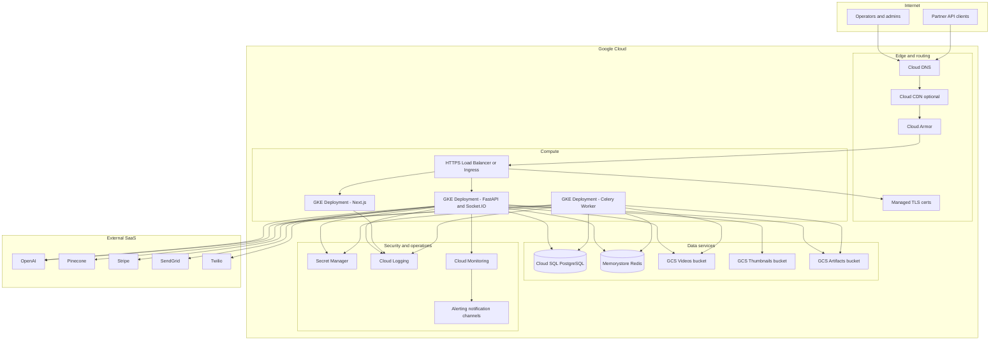

---

### 4.2 Diagram 2 — VPC network topology

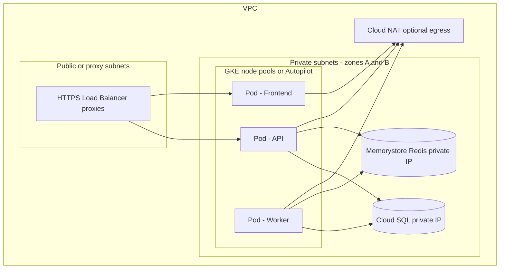

---

### 4.3 Diagram 3 — GKE workloads and load balancing

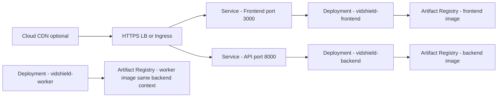

---

### 4.4 Diagram 4 — GCS storage and Cloud CDN origins

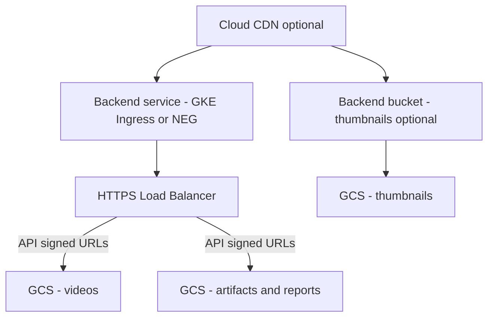

---

### 4.5 Diagram 5 — Security (Cloud Armor, secrets, IAM, encryption)

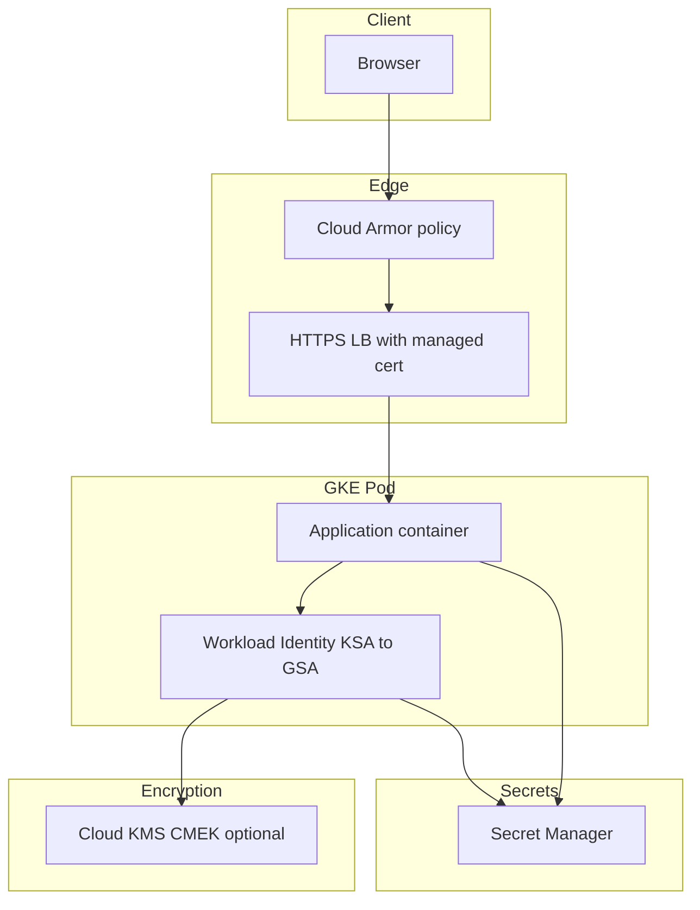

---

### 4.6 Diagram 6 — Video ingestion (sequence)

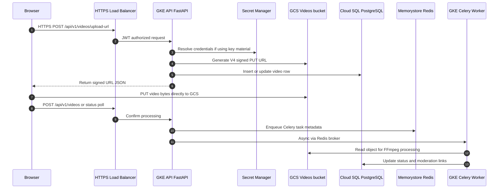

---

### 4.7 Diagram 7 — AI moderation pipeline (sequence)

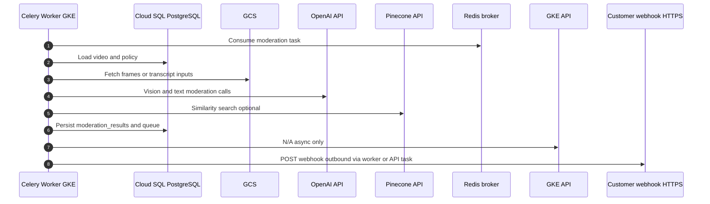

---

### 4.8 Diagram 8 — Realtime connectivity

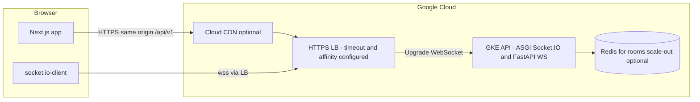

**Design note:** Configure backend timeout and session affinity (if using long-polling) for Socket.IO; WebSocket idle timeouts on the load balancer should exceed expected quiet periods for live streams.

---

### 4.9 Diagram 9 — CI/CD pipeline

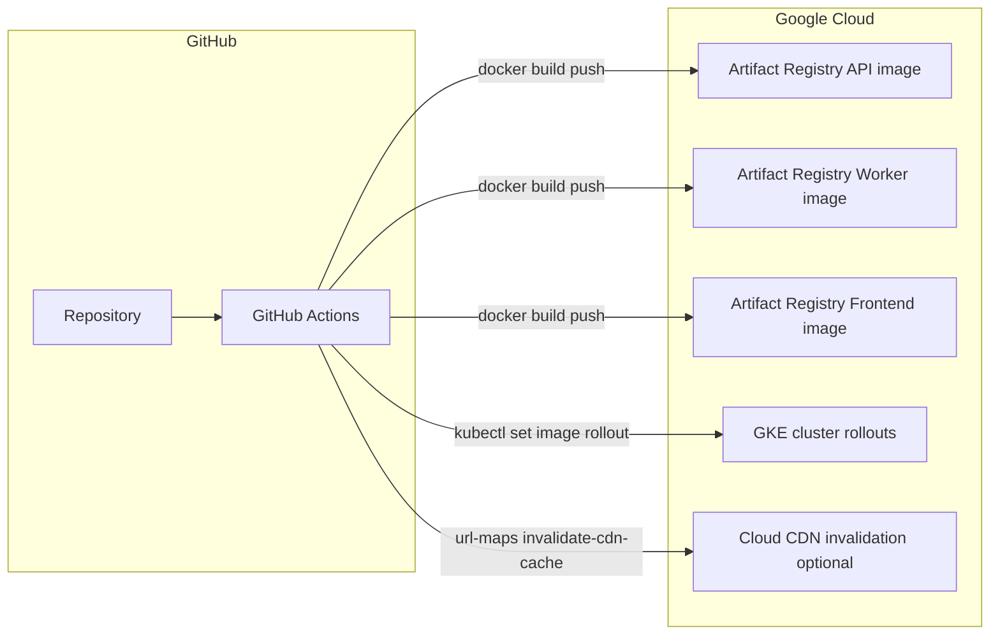

Authentication from GitHub Actions uses **Workload Identity Federation** (`google-github-actions/auth@v2`) with secrets `GCP_WORKLOAD_IDENTITY_PROVIDER` and `GCP_SERVICE_ACCOUNT`.

---

### 4.10 Diagram 10 — Observability

  ```mermaid
  flowchart TB
    subgraph gke["GKE workloads"]
      API[API pods]
      WK[Worker pods]
      FE[Frontend pods]
    end
    subgraph obs["Cloud Logging and Monitoring"]
      LG[Log buckets and log views]
      MT[Metrics - CPU memory request rate]
      AL[Alert policies on error rate latency SQL CPU]
    end
    NC[Notification channel]
    OPS[Email or Chat ops endpoint]

    API --> LG
    WK --> LG
    FE --> LG
    API --> MT
    AL --> NC
    MT --> AL
    NC --> OPS
  ```

---

### 4.11 Diagram 11 — High availability

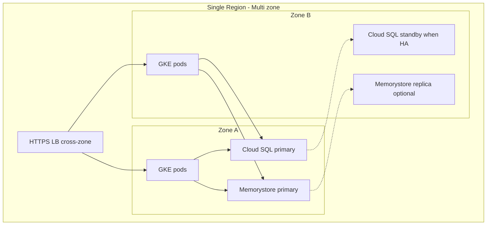

---

### 4.12 Diagram 12 — Optional Pub/Sub integration

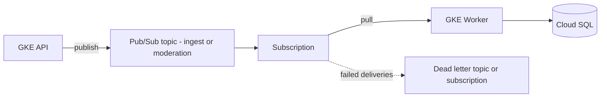

Celery today uses **Redis** as broker. **Pub/Sub** can complement the architecture for **cross-service buffering**, **fan-out**, or **Cloud Run** / **Cloud Functions** consumers while keeping Redis for Celery if desired.

---

## 5. Data classification and boundaries

| Data class | Examples | GCP storage / transit |
|------------|----------|------------------------|
| **Credentials / keys** | DB password, `SECRET_KEY`, API keys | **Secret Manager** + optional **KMS**; never in images |
| **PII** | User email, profile, audit logs | **Cloud SQL** encrypted; IAM least privilege; retention policies |
| **Video content** | Uploads, thumbnails | **GCS** buckets with lifecycle and access logging |
| **AI artifacts** | Embeddings metadata, reports | **GCS** artifacts; Pinecone vectors outside GCP |
| **Sessions / rate limits** | JWT refresh keys, rate limit counters | **Memorystore Redis** with TLS in production |

---

## 6. Cross-reference to repo docs

| Topic | Document |
|-------|----------|
| Product features | [PRD.md](PRD.md) |
| Code-level structure | [ARCHITECTURE.md](ARCHITECTURE.md), [LDL.md](LDL.md) |
| Conceptual design | [HDL.md](HDL.md) |
| HTTP API | [API_SPEC.md](API_SPEC.md) |
| Tables and migrations | [DB_SCHEMA.md](DB_SCHEMA.md) |
| Commands, compose, CI/CD names | [DEPLOYMENT.md](DEPLOYMENT.md) |
| Manual GCP procedures | [GCP_DEPLOYMENT_RUNBOOK.md](GCP_DEPLOYMENT_RUNBOOK.md) |
| PNG architecture pack | `docs/architecture_images/*.png` |

---

**End of document.** For Eraser.io, import diagrams **one section at a time** to tune layout (Eraser auto-layout may differ from GitHub rendering).
