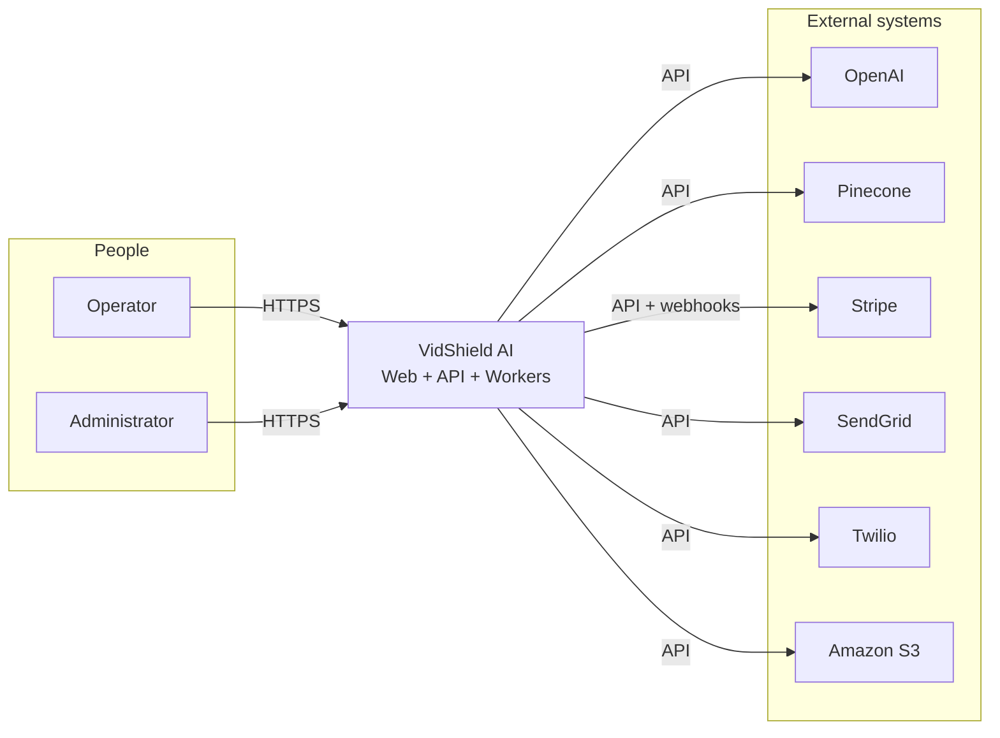
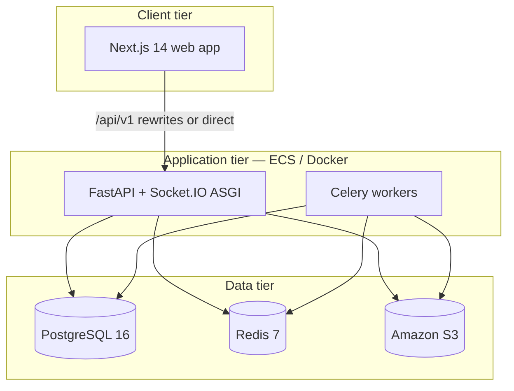

# VidShield AI — High-Level Design (HDL)

This document is the **High-Level Design (HDL)** for VidShield AI: scope, actors, logical components, deployment topology, and cross-cutting concerns. It aligns with the **implemented** codebase (`backend/`, `frontend/`, `terraform/`, `.github/workflows/`).

**Related:** [LDL.md](LDL.md) (module-level design), [ARCHITECTURE.md](ARCHITECTURE.md), [DEPLOYMENT.md](DEPLOYMENT.md), [PRD.md](PRD.md).

---

## 1. Purpose and scope

**VidShield AI** provides:

- Ingestion and lifecycle management for **recorded videos** (metadata, S3 keys, status, URL-based workflows).
- **AI-assisted moderation** (results, queue, human review, admin override) driven by LangGraph/LangChain pipelines and Celery workers.
- **Policies**, **webhooks**, **analytics**, **live streams** with alerts and moderation controls.
- **Reports** (async jobs, templates, PDF/S3 artifacts), **notifications** (email, in-app, WhatsApp), **billing** (Stripe), and **audit** surfaces (access, moderation, agent activity).
- A **Next.js** web application for operators and administrators, backed by a single **FastAPI** API surface.

**Out of scope in this repository:** native mobile apps; separate partner-only codebases (partners consume the same REST API).

---

## 2. Stakeholders and actors

| Actor | Description | Primary interface |
|--------|-------------|-------------------|
| **Operator** | Day-to-day video and moderation user | Web app (`operator` role) |
| **Administrator** | User management, audits, support tickets, billing metrics | Web app (`admin` role) |
| **API consumer** | Integrations / automation | REST `/api/v1` with JWT (`api_consumer` role where used) |
| **Anonymous user** | Registration, password reset, newsletter, support ticket submission | Public REST endpoints |
| **Platform operations** | Deployments, scaling, secrets | AWS, Terraform, GitHub Actions, Kubernetes (optional) |

---

## 3. Logical system context

---

## 4. Major building blocks

| Block | Responsibility |
|--------|------------------|
| **Web app** | UI, auth session handling, API client, optional mock API routes, server rewrites to backend |
| **API** | REST `/api/v1`, JWT auth, validation, orchestration into services, WebSocket/Socket.IO entry |
| **Workers** | Long-running video/moderation/analytics/report/notification/stream tasks |
| **PostgreSQL** | System of record for users, videos, moderation, policies, billing, audits, etc. |
| **Redis** | Rate limiting, Celery broker/backend, refresh-token / ephemeral patterns |
| **S3** | Video objects, thumbnails, generated report files (presigned access) |

---

## 5. Deployment views

### 5.1 Production (AWS — as defined in repo)

- **Compute:** Amazon **ECS** (Fargate assumed by workflow naming) — separate services for **API**, **worker**, **frontend** container images from **ECR**.
- **Networking:** **ALB** in front of API (and/or combined routing with CloudFront); private subnets for RDS/ElastiCache per **Terraform VPC module**.
- **Data:** **RDS PostgreSQL 16**, **ElastiCache Redis**, **S3** bucket(s) for media and reports.
- **Edge:** **CloudFront** optional; CD workflow can invalidate distribution **`CLOUDFRONT_DISTRIBUTION_ID_PROD`**.
- **CI/CD:** **GitHub Actions** — `ci.yml` for quality gates; **`cd-prod.yml`** for ECR push + ECS rolling deploy on tags / manual input.

### 5.2 Local / developer

- **Docker Compose:** `postgres`, `redis`, `backend`, `worker`, `frontend` with hot-reload on API and mounted source where configured.

### 5.3 Optional Kubernetes

- Manifests under **`k8s/`** with Makefile targets for apply, migrate job, logs, rollouts.

---

## 6. High-level data flows

### 6.1 Video upload (conceptual)

1. Client requests presigned upload URL from API.  
2. Client uploads bytes directly to **S3**.  
3. Client confirms or worker processes file → metadata persisted in **PostgreSQL**, status transitions, moderation pipeline **enqueued** to Celery.

### 6.2 Moderation decision path (conceptual)

1. Worker loads video context, runs **AI graph/chain** (OpenAI, optional Pinecone tools).  
2. **Moderation result** and optional **queue item** persisted.  
3. Webhooks / notifications dispatched per configuration.

### 6.3 Browser → API in production

1. Browser loads **HTTPS** Next.js app.  
2. Same-origin **`/api/v1/*`** requests hit Next server; **rewrites** forward to internal **`API_UPSTREAM_URL`**.  
3. API returns JSON; success responses wrapped in **`{ "data": ... }`** (middleware).

---

## 7. Security and compliance (high level)

- **Authentication:** JWT bearer tokens; refresh token flow with Redis-backed invalidation patterns (see auth routes).
- **Authorization:** Role-based dependencies — `admin`, `operator`, `api_consumer` on selected routes.
- **Transport:** TLS at ALB/CloudFront; app configured for `CORS_ORIGINS` allowlist.
- **Abuse controls:** Redis-backed **rate limiting** with tiered limits per route class; fail-open if Redis unavailable.
- **Secrets:** Environment variables / AWS Secrets Manager (operations concern; not hardcoded in application source).
- **Audit:** Access audit log, moderation audit views, agent audit log for AI observability.

---

## 8. Observability and operations

- **Structured logging:** `structlog` across API and Celery signals.
- **Health:** `GET /health` for liveness-style checks.
- **Sentry:** `SENTRY_DSN` exists in settings; SDK wiring is not present in `app/` (optional future wiring).

---

## 9. Non-functional characteristics (as implemented)

| Concern | Approach |
|---------|-----------|
| **Scalability** | Stateless API containers; horizontal ECS scaling; Celery worker pool scaling |
| **Availability** | Multi-AZ capable via Terraform subnets; ECS service restarts |
| **Consistency** | PostgreSQL transactional writes; eventual consistency for async worker side effects |
| **Performance** | Redis caching/rate limits; async SQLAlchemy on API; sync sessions in workers |

---

## 10. Document map

| Document | Level |
|----------|--------|
| **HDL.md** (this file) | Context, components, deployment, flows |
| **LDL.md** | Packages, routes, schemas, queues, key sequences |
| **ARCHITECTURE.md** | Middleware stack, folder layout, integration detail |
| **API_SPEC.md** | HTTP contract |
| **DB_SCHEMA.md** | Physical schema |
| **DEPLOYMENT.md** | Commands and environment variables |
