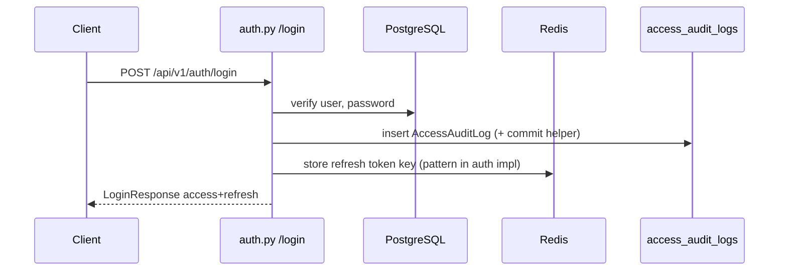
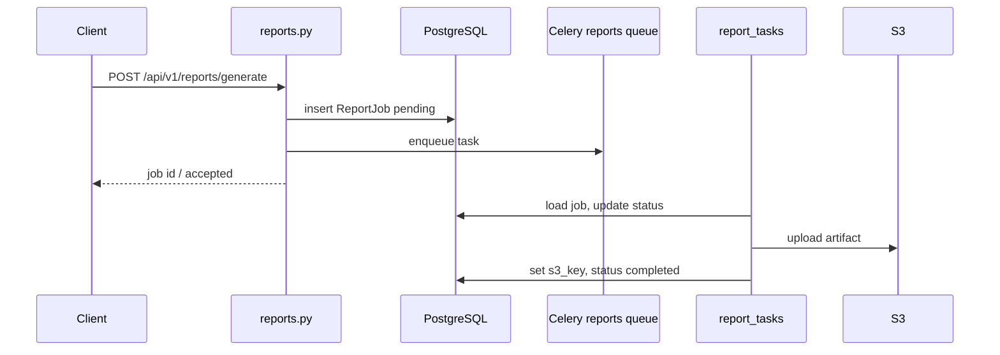

# VidShield AI — Low-Level Design (LDL)

This document is the **Low-Level Design (LDL)** for VidShield AI: concrete modules, routes, dependencies, queues, and behavioral contracts as found in the repository. It complements [HDL.md](HDL.md).

**Convention:** Paths are relative to repo root unless stated.

---

## 1. Backend application entry

| Item | Location | Notes |
|------|----------|--------|
| ASGI application | `backend/app/main.py` | `create_app()` → `app`; Socket.IO `sio` + `asgi_app = socketio.ASGIApp(sio, other_asgi_app=app)` |
| API router mount | `backend/app/main.py` | `include_router(api_router)` prefix `/api/v1` |
| Agent audit alias | `backend/app/main.py` | `/api/admin/agent-audit` → same handlers as v1 admin route |
| Lifespan | `backend/app/main.py` | Eager `get_engine()`, `get_redis_client()`; dispose on shutdown |
| Settings | `backend/app/config.py` | `pydantic-settings` `Settings`; `get_settings()` cached |
| DI / DB / Redis | `backend/app/dependencies.py` | Async engine, sessions, Redis client |

---

## 2. HTTP middleware stack (order)

Registration order in `main.py` (Starlette executes **reverse** of registration → **CORS** outermost):

1. `CORSMiddleware` — `allow_origins=settings.CORS_ORIGINS`, credentials, all methods/headers  
2. `RateLimitMiddleware` — `app/core/rate_limit.py`, Redis fixed window; exempt paths in matcher  
3. `RequestContextMiddleware` — `app/core/middleware.py`  
4. `DataWrapperMiddleware` — wraps 2xx JSON as `{"data": ...}`; skips `/health`, `/docs`, `/redoc`, `/openapi.json`

**Exception handlers** (`app/core/exceptions.py`):

- `AppException` → `{ "error": { "code", "message", "details" } }`
- `RequestValidationError` → `422` + `VALIDATION_ERROR` + `details.fields[]`
- Generic `Exception` → `500` + `INTERNAL_SERVER_ERROR`

---

## 3. API surface (`/api/v1`)

Router aggregation: `backend/app/api/v1/router.py`.

| Router module | Prefix | File |
|---------------|--------|------|
| auth | `/auth` | `api/v1/auth.py` |
| newsletter | `/newsletter` | `api/v1/newsletter.py` |
| billing | `/billing` | `api/v1/billing.py` |
| stripe_webhook | `/billing` | `api/v1/stripe_webhook.py` (`POST /webhook`) |
| admin_billing | `/admin/billing` | `api/v1/admin_billing.py` |
| users | `/users` | `api/v1/users.py` |
| videos | `/videos` | `api/v1/videos.py` |
| moderation | `/moderation` | `api/v1/moderation.py` |
| analytics | `/analytics` | `api/v1/analytics.py` |
| live | `/live` | `api/v1/live.py` |
| policies | `/policies` | `api/v1/policies.py` |
| webhooks | `/webhooks` | `api/v1/webhooks.py` |
| audit | `/audit` | `api/v1/audit.py` |
| alerts | `/alerts` | `api/v1/alerts.py` |
| api_keys | `/api-keys` | `api/v1/api_keys.py` |
| agent_audit | `/admin/agent-audit` | `api/v1/agent_audit.py` |
| reports | `/reports` | `api/v1/reports.py` |
| support_tickets | `/support-tickets` | `api/v1/support_tickets.py` |
| notifications | `/notifications` | `api/v1/notifications.py` |

**Auth dependency** (`backend/app/api/deps.py`):

- `HTTPBearer(auto_error=False)` → `get_current_user` → validates JWT `type == "access"`, loads `User` by `sub`, requires `is_active`.
- `require_role(*roles)` → `AdminUser`, `OperatorUser` typed aliases.

**Note:** API keys are created/stored in `api_keys` table but **request authentication** for routes uses Bearer JWT only (no API-key dependency in `deps.py`).

---

## 4. Persistence layer

### 4.1 ORM models

Package: `backend/app/models/`. Exported from `models/__init__.py` (includes `AccessAuditLog` via `audit.py`).

Key tables: `users`, `policies`, `videos`, `live_streams`, `moderation_results`, `moderation_queue`, `alerts`, `analytics_events`, `webhook_endpoints`, `access_audit_logs`, `api_keys`, `agent_audit_logs`, `report_templates`, `report_jobs`, `newsletter_signups`, `user_subscriptions`, `billing_payments`, `support_tickets`, `notifications`, `notification_preferences`, `password_reset_tokens`.

### 4.2 Migrations

Path: `backend/alembic/versions/`. Chain from `0001_initial_schema` through `0014_add_stripe_customer_id`.

Worker sync DB: `backend/app/core/sync_db.py` + `backend/app/workers/celery_app.py` → `sync_session()` context manager.

---

## 5. Celery workers

| Item | Location |
|------|----------|
| App | `backend/app/workers/celery_app.py` — `celery_app = Celery("vidshield")` |
| Broker / backend | `settings.CELERY_BROKER_URL`, `CELERY_RESULT_BACKEND` (derived from `REDIS_URL` if unset) |
| TLS | If broker starts with `rediss://`, `ssl.CERT_NONE` for ElastiCache-style endpoints |
| Task routes | `video` ← `video_tasks.*`, `moderation` ← `moderation_tasks.*`, `streams` ← `stream_tasks.*`, `analytics`, `cleanup`, `reports`, `notifications` |
| Autodiscover | `video_tasks`, `moderation_tasks`, `analytics_tasks`, `cleanup_tasks`, `report_tasks`, `notification_tasks`, `stream_tasks` |
| Beat | `daily-digest-0800-utc` → `send_daily_digests_beat_task` on `notifications` queue |

Docker Compose worker command includes explicit `--queues video,moderation,analytics,cleanup,reports,notifications,streams`.

---

## 6. AI subsystem

| Area | Path |
|------|------|
| Graphs | `backend/app/ai/graphs/` (`video_analysis_graph.py`, `moderation_workflow.py`) |
| Chains | `backend/app/ai/chains/` |
| Agents | `backend/app/ai/agents/` |
| Tools | `backend/app/ai/tools/` (frames, whisper, ocr, object_detector, similarity_search, face_analyzer, …) |
| Prompts | `backend/app/ai/prompts/` |
| Agent audit pipeline | `backend/app/ai/pipeline_agent_audit.py` |
| State / schemas | `backend/app/ai/state.py`, `schemas.py` |

OpenAI client usage is centralized in chains/tools/agents with `settings.OPENAI_API_KEY` and model fields `OPENAI_MODEL` / `OPENAI_MINI_MODEL`.

---

## 7. Key service modules

Located under `backend/app/services/` (non-exhaustive): `auth_service`, `video_service`, `moderation_service`, `analytics_service`, `storage_service`, `stream_service`, `notification_service`, `notification_dispatcher`, `email_service`, `billing_service`, `report_service`, `pdf_service`, `whatsapp_service`, `agent_audit_service`, etc.

**Pattern:** Routers validate input (Pydantic), call services, map ORM → response schemas.

---

## 8. Realtime interfaces

| Mechanism | Path / mount | Implementation file |
|-----------|----------------|------------------------|
| Socket.IO | `/socket.io/` | `main.py` — `connect`/`disconnect`/`join`/`leave` |
| WebSocket | `/api/v1/live/ws/streams/{stream_id}` | `api/v1/live.py` |

---

## 9. Frontend low-level structure

| Area | Path | Role |
|------|------|------|
| App Router pages | `frontend/src/app/` | `(auth)`, `(app)`, `docs`, `legal`, marketing routes |
| API base resolution | `frontend/src/lib/constants.ts` | `API_BASE_URL`, `WS_URL`, `API_V1`; production/staging forces same-origin empty base |
| HTTPS mixed-content guard | `frontend/src/lib/apiOrigin.ts` | Browser upgrades `http`→`https` for API origin when page is HTTPS |
| HTTP client | `frontend/src/lib/api.ts` | Axios + interceptors / helpers |
| Rewrites | `frontend/next.config.js` | `/api/v1/:path*` → `API_UPSTREAM_URL` or `NEXT_PUBLIC_API_URL` unless `NEXT_PUBLIC_MOCK_API === 'true'` |

---

## 10. Sequence — login (low level)

(Exact Redis key layout: see `app/core/security.py` / auth route implementation.)

---

## 11. Sequence — report generation (low level)

---

## 12. Configuration reference (environment)

Defined in `backend/app/config.py` (subset):

- `APP_NAME`, `APP_ENV`, `DEBUG`
- `DATABASE_URL`, `DATABASE_URL_SYNC`, `REDIS_URL`, `CELERY_BROKER_URL`, `CELERY_RESULT_BACKEND`
- `SECRET_KEY`, `JWT_ALGORITHM`, token TTLs, `FRONTEND_URL`, password reset limits
- `AWS_*`, `S3_BUCKET_NAME`, `S3_PRESIGNED_URL_EXPIRE`
- `OPENAI_*`, `PINECONE_*`
- `SENDGRID_*`, `TWILIO_*`
- `STRIPE_*`
- `SENTRY_DSN`, `CORS_ORIGINS`, `DEFAULT_PAGE_SIZE`, `MAX_PAGE_SIZE`

Frontend: `NEXT_PUBLIC_*`, `API_UPSTREAM_URL` (build-time / runtime per Next).

---

## 13. Testing and quality gates

| Layer | Command / location |
|--------|---------------------|
| Backend unit/integration | `cd backend && pytest` — `Makefile` target `test-backend` |
| Backend lint | `ruff check`, `ruff format --check` — `.github/workflows/ci.yml` |
| Frontend lint | `npm run lint` |
| Frontend tests | `npm test` |
| E2E | `npm run test:e2e` (Playwright) |

---

## 14. Change impact checklist (for engineers)

| Change type | Typical touch points |
|-------------|---------------------|
| New REST endpoint | `api/v1/<domain>.py`, `schemas/`, optional `services/`, tests under `backend/tests/` |
| New table | `models/`, new Alembic revision, optional seed |
| New async job | `workers/<module>.py`, `celery_app.py` route + queue name, Docker Compose worker `--queues` |
| New env var | `config.py`, `.env.example`, deployment secrets (ECS task def / Terraform) |
| New UI page | `frontend/src/app/...`, components, `lib/api.ts` |

---

## 15. Glossary

| Term | Meaning in this project |
|------|-------------------------|
| **HDL** | High-level design — [HDL.md](HDL.md) |
| **LDL** | Low-level design — this document |
| **ASGI app** | `app.main:asgi_app` (Socket.IO + FastAPI) for production parity with realtime |
